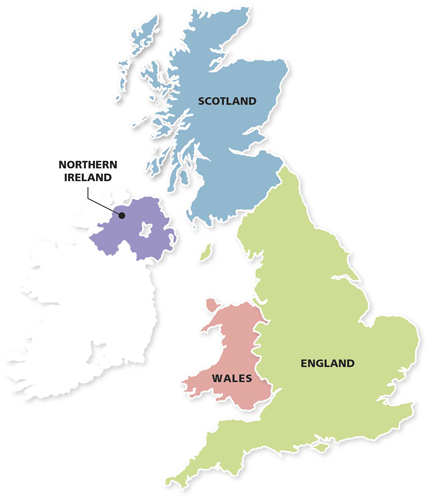
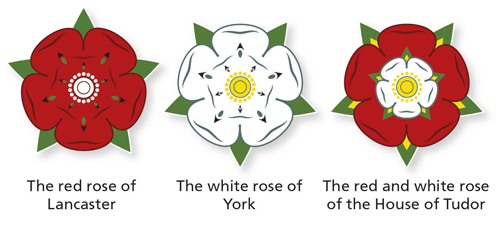

# Minimum Age

## 16
- to participate in the National Lottery.
- people can drink wine or beer with a meal in a hotel or restaurant (including eating areas in pubs) as long as they are with someone over 18.
- to ride a moped, and there are other age requirements and special tests for driving large vehicles.

## 18
- to buy alcohol in a pub or night club. But people under this age may be allowed in some pubs with an adult. (It is a criminal offence to sell alcohol to anyone who is under 18 or to buy alcohol for people who are under the age of 18.)
- It is illegal and a criminal offence to sell tobacco products (for example, cigarettes, cigars, roll-up tobacco) to anyone under the age of 18.
- to go into betting shops or gambling clubs. 
- Most citizens of the UK, the Irish republic or the Commonwealth aged 18 or over **can stand for** public office. There are some **exceptions**, including:
  - members of the armed forces,
  - civil servants,
  - people found guilty of certain criminal offences.
- can stand for election as an MP.

# Geography

Great Britain refers only to England, Scotland and Wales, not to Northern Ireland.

There are several islands which are closely linked with the UK but are not part of it: **the Channel Islands** and **the Isle of Man**. These have their own governments and are called **‘Crown dependencies’**.

The capital city of the UK is London.

The London Eye is situated on the **southern bank** of the River Thames and is a Ferris wheel that is **443 feet (135 metres)** tall. (not a World Heritage Site).

The Millennium Stadium is located in **Cardiff**.

**The National Trust** and **Friends of the Earth** are environmental charities.

**Skara Brae on Orkney**, off the **north coast of Scotland**, is the best preserved prehistoric village in northern Europe, and has helped archaeologists to understand more about how people lived near the end of the **Stone Age**.

British overseas territories:
- Anguilla
- Bermuda
- British Antarctic Territory
- British Indian Ocean Territory
- British Virgin Islands
- Cayman Islands
- Falkland Islands
- Gibraltar
- Montserrat
- Pitcairn Islands
- Saint Helena, Ascension and Tristan da Cunha
- South Georgia and the South Sandwich Islands
- Turks and Caicos Islands

# Law

The Human Rights Act 1998 incorporated the European Convention of Human Rights into UK law.

Some of the principles included in the European Convention on Human Rights are:
- right to life
- prohibition of torture
- prohibition of slavery and forced labour
- right to liberty and security
- right to a fair trial
- freedom of thought, conscience and religion
- freedom of expression (speech).

British values and principles are based on **history** and **traditions** and are protected by law, customs and expectations.

The UK offers to its residents or citizens:
- freedom of belief and religion,
- freedom of speech,
- freedom from unfair discrimination,
- a right to a fair trial
- and a right to join in the election of a government.

The electoral register is updated every year in **September or October**.

To drive a car in the UK you need a driving licence, a valid motor insurance, a MOT certificate (for cars over three years old) and the road tax.

Drivers can use their driving licence until they are **70** years old. After that, the licence is valid for **three** years at a time.

Decisions on government policies are made by the **Prime Minister** and **cabinet**.

In the UK, bank holidays of **no religious** significance are celebrated **at the beginning of May** in **late May** or **early June**, and in **August**.

There are 100 pence in a pound.

For most local authorities, local elections for councillors are held in **May** **every year**.

In the UK, if the jury finds a defendant guilty, the judge decides the penalty.

All of the elected **MPs** form the **House of Commons**.

**Arranged marriages**, where both parties agree to the marriage, are acceptable in the UK.

The Life in the UK test is usually taken is **English**, although special arrangements can be made if you wish to take it in **Welsh** or **Scottish Gaelic**.

A non-UK national living in the UK and looking for work, starting work or setting up as self-employed will need a **National Insurance number**. However, you **can** start work without one.

It is a criminal offence to carry a weapon of any kind, **even if it is for self-defence**. This includes a gun, a knife or anything that is made or adapted to cause injury.

UK laws ensure that people are not treated unfairly in any area of life or work because of their age, disability, sex, pregnancy and maternity, race, religion or belief, sexuality or marital status.

As part of the citizenship ceremony, new citizens pledge their **loyalty to the United Kingdom** and to **respect its rights and freedoms**.

**Democracy** is a system of government where the whole adult population gets a say. This might be by **direct voting** or by **choosing representatives** to make decisions on their behalf.

The **cabinet** is a committee which usually meets **weekly** and makes important decisions about government policy.

The police force is a public service that helps and protects everyone, no matter what their background or where they live.

The UK is part of the United Nations (UN), an international organization with **more than 190** countries as members.

The UK is governed by the parliament sitting in **Westminster**</strong>**.

The fundamental principles of British life include:
- democracy,
- the rule of law,
- individual liberty,
- tolerance of those with different faiths and beliefs and
- participation in community life.

If you are facing domestic violence you can get help from the **24-hour National Domestic Violence Freephone Helpline** at any time, or the **police** can help you find a safe place to stay.

The Chancellor of the **Exchequer** is responsible for the economy.

If your driving licence if from a country in the **European Union (EU), Iceland, Liechtenstein or Norway**, you can drive in the UK for as long as your licence is valid.

In Northern Ireland, a newly qualified driver must display an **‘R’** plate (for restricted driver) for **one** year after passing the test.

If you are resident in the UK, your car or motor cycle must be registered at the Driver and Vehicle Licensing Agency (DVLA).

You can contact MPs by **letter** or **telephone** at their **constituency office**, or at their office in the **House of Commons**.

Each MP represents a **parliamentary constituency**, which is a **small area of the country**.

The House of Lords is normally more independent of the government than the House of Commons.

The second-largest party in the House of Commons is called the **opposition**.

Debates in the House of Commons are chaired by the **Speaker**. This person is the **chief officer** of the **House of Commons**.

**Members of the House of Lords** may not stand for election to the **House of Commons** but are eligible for all other public offices.

The **House of Lords** can suggest amendments or propose new laws, which are then discussed by MPs. The House of Lords checks laws that have been passed by the **House of Commons** to ensure they are fit for purpose. It also holds the government to account to make sure that it is working in the best interests of the **people**.

The UK has a **constitutional monarchy**.

The Prime Minister (PM) is the **leader of the political party** in power. He or she appoints the **members of the cabinet** and has control over many important public appointments.

The Prime Minister appoints about **20 senior MPs** to become ministers in charge of departments.

The small claims procedure is an informal way of helping people to settle minor disputes without spending a lot of time and money using a lawyer. This procedure is used for claims of less than £10,000 in England and Wales and £3,000 in Scotland and Northern Ireland. 
**PLEASE be aware** that in some handbooks (10th impression 2016 and previous ones) it says £5,000. However according to the Official Handbook 3rd edition (11th impression 2016) it is £10,000. Due to this difference in data, it is very unlikely that this question will come up in the official exam.

Forcing another person to marry is a criminal offence.

Anyone who is violent towards their partner – whether they are a man or a woman, married or living together – can be prosecuted.

Many MPs, Assembly members, MSPs and MEPs hold regular local **‘surgeries’**, where constituents can go in person to talk about issues that are of concern to them. These surgeries are often advertised in the **local newspaper**.

The job of the police in the UK is to protect life and property, prevent disturbances (also known as keeping the peace) and prevent and detect crime.

Many local authorities appoint a **mayor**, who is the ceremonial leader of the council. In some towns, a mayor is elected to be the effective leader of the administration.

**MPs** are elected through a system called **‘first past the post’**. In each constituency, the candidate who gets the most votes is elected.

# Organisations

## EU

Elections for the European Parliament are held every **five** years. Elected members are called **members of the European Parliament (MEPs)**.

Elections to the European Parliament use a system of **proportional representation**, where seats are allocated to each party in proportion to the total number of votes it has won.

The UK is a **full member** of the European Union but does not use the Euro currency.

The Council of Europe is responsible for the **protection and promotion of human rights** in those countries. The Council of Europe has no power to make laws but **draws up conventions and charters**, the most well-known of which is the **European Convention on Human Rights and Fundamental Freedoms**.

The European Council is not part of the British government.

European Union:

List of Former EU Member Countries:
- United Kingdom (UK)

List of Official EU Candidate Countries:
- Albania
- North Macedonia
- Montenegro
- Serbia
- Turkey

List of Potential EU Candidate Countries:
- Bosnia and Herzegovina
- Kosovo

List of European Countries That Aren't EU Members, Candidates, or Potential Candidates:
- Andorra
- Belarus
- Moldova
- Iceland*
- Liechtenstein
- Monaco 
- Norway*
- Russia**
- San Marino
- Switzerland*
- Ukraine
- Vatican City

List of Arguably European Countries That Aren't EU Members, Candidates, or Potential Candidates:
- Armenia (physically on Asian side, but within Transcaucasia)
- Azerbaijan (in Transcaucasia, mostly in Asia with small parts in Europe)
- Georgia (in Transcaucasia, mostly in Asia with small parts in Europe)
- Kazakhstan (mostly in Asia, with a small part in Europe)

## NATO

NATO is a group of European and North American countries that have agreed to help each other if they come **under attack**. It also aims to **maintain peace** between all of its members.

## Commonwealth

The Commonwealth has no power over its members, although it can suspend membership.

Membership to the Commonwealth is **voluntary**.

The Commonwealth is based on the core values of
- democracy,
- good government
- and the rule of law.

The Queen is the ceremonial head of the Commonwealth.

The Commonwealth is an association of countries that support each other and work together towards shared goals in democracy and development. Most member states were once part of the British Empire, although a few countries which were not have also joined.

There are 54 countries in the Commonwealth
- Africa
  - Botswana
  - Cameroon
  - Gambia, The
  - Ghana
  - Kenya
  - Kingdom of Eswatini
  - Lesotho
  - Malawi
  - Mauritius
  - Mozambique
  - Namibia
  - Nigeria
  - Rwanda
  - Seychelles
  - Sierra Leone
  - South Africa
  - Uganda
  - United Republic of Tanzania
  - Zambia
- Asia
  - Bangladesh
  - Brunei Darussalam
  - India
  - Malaysia
  - Maldives
  - Pakistan
  - Singapore
  - Sri Lanka
- Caribbean and Americas 
  - Antigua and Barbuda
  - Bahamas, The
  - Barbados
  - Belize
  - Canada
  - Dominica
  - Grenada
  - Guyana
  - Jamaica
  - Saint Lucia
  - St Kitts and Nevis
  - St Vincent and The Grenadines
  - Trinidad and Tobago
- Europe
  - Cyprus
  - Malta
  - United Kingdom
- Pacific
  - Australia
  - Fiji
  - Kiribati
  - Nauru
  - New Zealand
  - Papua New Guinea
  - Samoa
  - Solomon Islands
  - Tonga
  - Tuvalu
  - Vanuatu

Zimbabwe, Costa Rica are not members of the Commonwealth.

# History

During the Middle Ages many knights took part in the Crusades, in which European Christians fought for control of the **Holy Land**.

During the First World War millions of people were killed or wounded, with more than **2 million** British casualties.

The **Normans** used a system of land ownership known as **feudalism**.

During the **Bronze** Age people lived in **roundhouses** and buried their dead in tombs called **round barrows**.

**Catherine Howard** was a **cousin** of **Anne Boleyn**.

**Stone Age**: The first people to live in Britain were **hunter-gatherers**.

Throughout the 1990s, Britain played a leading role in coalition forces involved in the liberation of Kuwait, following the Iraqi invasion in 1990, and the conflict in the former Republic of Yugoslavia.

In the Middle Ages, **Knights**, who were usually **smaller landowners**, and **wealthy people** from towns and cities were elected to sit in the **House of Commons**.

During the Middle Ages, England was an important trading nation and people came to England from abroad to trade and also to work. Many had special skills:
- weavers from France,
- engineers from Germany,
- glass manufacturers from Italy
- and canal builders from Holland.

The Parliament developed in Scotland in the Middle Ages had three Houses, called **Estates**:
- the lords,
- the commons
- and the clergy.

The Middle Ages (or the medieval period) was a time of almost **constant war**.

In the Middle Ages, the numbers attending Parliament increased and two separate parts, known as **Houses** were established. These were the House of the **Commons** and the House of the **Lords**.

During the Middle Ages, **great landowners** and **bishops** sat in the House of **Lords**.

**Lincoln Cathedral** was built in the middle ages.

At the beginning of the Middle Ages, Ireland was an independent country.

During the middle ages, several cathedrals had windows of stained glass, telling stories about the **Bible** and **Christian saints**. The glass in **York Minster** is a famous example.

Anne Boleyn was executed at the tower of London.

Catherine of Aragon was a Spanish princess.

Following the Black Death, the smaller population meant there was less need to grow cereal crops. There were **labour shortages** and peasants began to demand **higher wages**. New social classes appeared, including **owners of large areas of land** (later called the **gentry**), and people left the countryside to live in the towns. In the towns, growing wealth led to the development of a **strong middle class**.

Queen Mary was a devout **Catholic** and persecuted **Protestants** (for this reason, she became known as ‘Bloody Mary’).

In the **late 1970s**, the post-war economic boom came to an end.

The **Great Western Railway** was the first major railway built in Britain.

English kings fought a long war with France, called the Hundred Years War (even though it actually lasted **116** years).

To divorce his first wife, Henry VIII needed the approval of the **Pope**. When the Pope refused, Henry established the **Church of England**. In this new church, the **king**, not the Pope, would have the power to appoint bishops and order how people should worship.

The symbol of the House of **Tudor** was a red rose with a white rose inside it as a sign that the Houses of York and Lancaster were now allies.

The Battle of **Hastings** is commemorated in a great piece of embroidery, known as the **Bayeux tapestry**, which can still be seen in **France** today. The Bayeux Tapestry is nearly **70 metres (230 feet)** long and is embroidered with coloured wool.

During the Victorian period, the British Empire grew to cover all of India, Australia and large parts of Africa. It became the largest empire the world has ever seen, with an estimated population of more than **400 million** people.

# Economy

Although the UK had won the war, the country was exhausted economically after WWII.

For most people, the right amount of income tax is automatically taken from their income from employment by their employer and paid directly to HM Revenue & Customs (HMRC), the government department that collects taxes. This system is called **“Pay As You Earn” (PAYE)**.

Money raised from income tax pays for government services such as roads, education, police and the armed forces.

# Culture

Words such as Grimsby and Scunthorpe come from the Viking languages.

‘PDSA’ stands for People’s Dispensary for Sick Animals.

The public can listen to debates in the Palace of Westminster from **public galleries** in both the **House of Commons** and the **House of Lords**.

Proceedings in Parliament are broadcast on television and published in official reports called **Hansard**.

Vaccinations and medical treatment for animals are available from veterinary surgeons (vets).

People in the UK are living longer than ever before. This is due to improved living standards and better health care. There are now a record number of people aged 85 and over. This has an impact on the cost of **pensions** and **health care**.

Some words in modern English – for example, ‘park’ and ‘beauty’ – are based on Norman French words.

Giving blood only takes about **an hour** to do.

Donated blood is used by hospitals to help people with a wide range of **injuries** and **illnesses**.

Living people can donate **blood** and **a kidney**.

The Life in the UK test is usually taken is English, although special arrangements can be made if you wish to take it in **Welsh** or **Scottish Gaelic**.

To apply to become a permanent resident or citizen of the UK, you will need to **speak and read English** and have **a good understanding of life** in the UK.

A Formula 1 **Grand Prix** event is held in the UK **each** year and a number of British Grand Prix drivers have won the Formula 1 World Championship.

---

# The values and principles of the UK

- British society is founded on fundamental **values** and **principles** which all those living in the UK should respect and support. These values are reflected in the responsibilities, rights and privileges of being a British citizen or permanent resident of the UK.
- They are based on **history** and **traditions** and are protected by **law**, **customs** and **expectations**.
- There is no place in British society for extremism or intolerance.
- The fundamental principles of British life include:
  - Democracy
  - The rule of law
  - Individual liberty
  - Tolerance of those with different faiths and beliefs
  - Participation in community life.
- As part of the citizenship ceremony, new citizens pledge to uphold these
values. The pledge is:

<blockquote>‘I will give my loyalty to the United Kingdom and respect its rights and
freedoms. I will uphold its democratic values. I will observe its laws
faithfully and fulfil my duties and obligations as a British citizen.’</blockquote>

- Flowing from the fundamental principles are **responsibilities and freedoms** which are shared by all those living in the UK and which we expect all residents to respect.
- If you wish to be a permanent resident or citizen of the UK, you should:
  - Respect and obey the law
  - Respect the rights of others, including their right to their own opinions
  - Treat others with fairness
  - Look after yourself and your family
  - Look after the area in which you live and the environment.
- In return, the UK offers:
  - Freedom of belief and religion
  - Freedom of speech
  - Freedom from unfair discrimination
  - A right to a fair trial
  - A right to join in the election of a government.

## Becoming a permanent resident

- you will need to:
  - Speak and read English (English B1 of the Common European Framework of Reference (= ESOL Entry Level 3). or by having a recognised English test qualification from an approved test centre.)
  - Have a good understanding of life in the UK. (Pass the Life in the UK test)

## Taking the Life in the UK Test
- 24 questions.
- not need to remember dates of birth or death.
- test is usually taken in English, although special arrangements can be made if you wish to take it in **Welsh** or **Scottish Gaelic**.
- If you live on the Isle of Man or in the Channel Islands, there are different arrangements for taking the Life in the UK test.

---

# What is the UK?

- The UK is made up of England, Scotland, Wales and Northern Ireland.
- The rest of Ireland is an independent country.
- The official name: the United Kingdom of Great Britain and
Northern Ireland.
- Great Britain: England, Scotland and Wales.
- The words ‘Britain’, ‘British Isles’ or ‘British’, however, are used here to refer to everyone in the UK.
- Islands which are closely linked with the UK but are not part of it:
  - the Channel Islands
  - the Isle of Man.
- These have their own governments and are called **‘Crown dependencies’**.
- British overseas territories (They are linked to the UK but are not part of it):
  - St Helena
  - the Falkland Islands
- The UK is governed by the parliament sitting in **Westminster**.
- Scotland, Wales and Northern Ireland also have parliaments or assemblies of their
own, with devolved powers in defined areas. 

---

# A Long and Illustrious History

## Early Britain

### Stone Age

- hunter-gatherers: the first people to live in Britain.
- For much of the Stone Age, Britain was connected to the
continent by a **land bridge**. People came and went, following the herds of
deer and horses which they hunted.
- The first farmers built houses, tombs and monuments on the land.
- Survived Stone Age sites:
  - **Stonehenge** (a monument, World Heritage Site), still stands in what is now the English county of **Wiltshire**. Stonehenge was probably a special gathering place for **seasonal ceremonies**.
  - **Skara Brae on Orkney**, off the **north** coast of **Scotland**, is the best preserved prehistoric village in northern Europe, and has helped archaeologists to understand more about how people lived near the end of the Stone Age. 

### Bronze Age

- People lived in **roundhouses** and buried their dead in tombs called **round barrows**.
- The people were accomplished metalworkers who made many beautiful objects in bronze and gold, including tools, ornaments and weapons.

### Iron

- people learned how to make weapons and tools out of iron.
- People still lived in **roundhouses** grouped together into **larger settlements**, and sometimes defended sites called **hill forts**.
- A very impressive hill fort can still be seen today at **Maiden Castle**, in the English county of **Dorset**. 
- Most people were **farmers, craft workers or warriors**.
- The language they spoke was part of the **Celtic** language family. Similar languages were spoken across Europe in the Iron Age and related languages are still spoken today in some parts of Wales, Scotland and Ireland.
- The people of the Iron Age had a sophisticated culture and economy. They made the **first coins** to be minted in Britain, some inscribed with the **names of Iron Age kings**. This marks the beginnings of British history. 

### The Romans

- In AD 43 the Emperor Claudius led the Roman army in a new invasion. The Romans were successful in occupying almost all of Britain.
- Boudicca (a tribal leader, the queen of the Iceni in what is now eastern England) fought against the Romans. She is still remembered today and there is a statue of her on **Westminster Bridge in London**, near the Houses of Parliament.
- **Scotland** were never conquered by the Romans.
- The Emperor **Hadrien** built a wall in the north of England to keep out the **Picts** (ancestors of the Scottish people). Included in the wall were a number of forts. Parts of Hadrien’s Wall, including the forts of **Housesteads** and **Vindolanda**, can still be seen. It is a popular area for walkers and is a UNESCO (United Nations Educational, Scientific and Cultural Organization) World Heritage Site.
- The Romans remained in Britain for 400 years. They built roads and public buildings, created a structure of law, and introduced new plants and animals.

### The Anglo-Saxons

- Britain was again invaded by tribes from northern Europe:
  - the Jutes,
  - the Angles
  - and the Saxons.
- The languages they spoke are the basis of modern-day English.
- Sutton Hoo's (an Anglo-Saxon king) burial place is in modern Suffolk. This king was buried with treasure and armour, all placed in a **ship** which was then covered by a mound of earth.
- Parts of the west of Britain, including much of what is now Wales, and Scotland, remained free of Anglo-Saxon rule.
- The Anglo-Saxons were not Christians when they first came to Britain but, during this period, **missionaries** came to Britain to preach about Christianity.
- Missionaries from Ireland spread the religion in the north:
  - **St Patrick**, who would become the patron saint of Ireland,
  - **St Columba**, who founded a monastery on the island of Iona, off the coast of what is now Scotland.
  - **St Augustine** led missionaries from Rome, who spread Christianity in the south. St Augustine became the **first Archbishop of Canterbury**.

### The Vikings

- The Anglo-Saxon kingdoms in England united under **King Alfred the Great**, who defeated the Vikings.
- Many of the Viking invaders stayed in Britain – especially in the east and north of England in an area known as the **Danelaw** (many place names there, such as Grimsby and Scunthorpe come from the Viking languages).
- The Viking settlers mixed with local communities and some converted to Christianity.
- Anglo-Saxon kings continued to rule what is now England, except for a short
period when there were Danish kings. The first of these was **Cnut**, also
named **Canute**.
- In the north, the threat of attack by Vikings had encouraged the people to unite under one king, **Kenneth MacAlpin**. The term Scotland began to be used to describe that country.

## The Norman Conquest

- The Battle of Hastings in 1066 is commemorated in a great piece of embroidery, known as the **Bayeux Tapestry** (70 metres (230 feet) long, colored wool), which can still be seen in France today. 
- The Norman Conquest was the last successful foreign invasion of England and led to many changes in government and social structures in England.
- Norman French, the language of the new ruling class influenced the development of the English language as we know it today.
- Initially the Normans also conquered Wales, but the Welsh gradually won territory back.
- The Scots and the Normans fought on the border between England and Scotland; the Normans took over some land on the border but did not invade Scotland.
- **Domesday Book**: William sent people all over England to draw up lists of all the towns and villages. The people who lived there, who owned the land and what animals they owned were also listed. It still exists today and gives a picture of society in England just after the Norman Conquest.

## The Middle Ages

### War at home and abroad

- Middle Ages (or the medieval period):
  - end of the Roman Empire in AD 476 - 1485 (Broadly speaking).
  - the Norman Conquest (1066) - 1485 (the focus here).
- It was a time of almost constant war.
- The English kings fought with the Welsh, Scottish and Irish noblemen for
control of their lands.
- In Wales, the English were able to establish their rule.
  - By the middle of the 15th century the last Welsh rebellions had been defeated.
  - English laws and the English language were introduced.
- Scotland remained unconquered by the English.
- At the beginning of the Middle Ages, Ireland was an independent country. The English first went to Ireland as troops to **help** the Irish king and remained to build their own settlements.
- During the Middle Ages, the English kings also fought a number of wars abroad:
  - Many knights took part in the Crusades, in which European Christians fought for control of the **Holy Land**.
  - English kings also fought a long war with France, called the Hundred Years War (even though it actually lasted 116 years).

### Feudalism

- The Normans used a system of land ownership known as **feudalism**. The king gave land to his lords in return for help in war. Landowners had to send certain numbers of men to serve in the army. Some **peasants** had their own land but most were **serfs**. They had a small area of their lord’s land where they could grow food. In return, they had to work for their lord and could not move away.
- The same system developed in southern Scotland. In the north of Scotland and Ireland, land was owned by members of the **‘clans’** (prominent families).

### The Black Death

- In 1348, **1/3** of the population of England died and a similar proportion in Scotland and Wales.
- This was one of the worst disasters ever to strike Britain.
- Following the Black Death, the smaller population meant there was less need to grow **cereal crops**.
- There were **labour shortages** and peasants began to demand higher wages.
- New social classes appeared, including owners of large areas of land (later called the **gentry**), and people left the countryside to live in the towns. In the towns, growing wealth led to the development of a strong **middle class**.
- In Ireland, the Black Death killed many in the **Pale** and, for a time, the area controlled by the English became **smaller**.

### Legal and political changes

- In the Middle Ages, Parliament began to develop into the institution it is today. Its origins can be traced to the king’s council of advisers, which included important **noblemen** and the **leaders of the Church**.
- In England, parliaments were called for the king to consult his nobles, particularly when the king needed to raise money. The numbers attending Parliament increased and two separate parts, known as Houses, were established.
- House of Lords:
  - nobility
  - great landowners
  - bishops
- House of Commons (elected)
  - Knights, who were usually smaller landowners
  - wealthy people from towns and cities
- Only a small part of the population was able to join in electing the members of the Commons.
- A similar Parliament developed in Scotland. It had three Houses, called **Estates**:
  - the lords
  - the commons
  - the clergy
- This was also a time of development in the legal system. The principle that judges are independent of the government began to be established.
- In England, judges developed ‘common law’ by a process of **precedence** (that is, following previous decisions) and tradition.
- In Scotland, the legal system developed slightly differently and laws were ‘codified’ (that is, written down).

### A distinct identity

- English: graduallly combined by Norman French (spoken by the king and his noblemen) and Anglo-Saxon (spoken by peasants) after the Norman Conquest.
- Norman French words: ‘park’ and ‘beauty’
- Anglo-Saxon words: ‘apple’, ‘cow’ and ‘summer’
- In modern English there are often two words with very similar meanings, one from French and one from AngloSaxon. ‘Demand’ (French) and ‘ask’ (Anglo-Saxon) are examples.
- Canterbury Tales was one of the first books to be printed by **William Caxton**, the first person in England to print books using a printing press. Many of the stories are still popular. Some have been made into plays and television programmes.
- In Scotland, many people continued to speak Gaelic and the Scots language also developed. A number of poets began to write in the Scots language. One example is **John Barbour**, who wrote *The Bruce* about the Battle of **Bannockburn**.
- Castles were built in many places in Britain and Ireland, partly for **defence**. Today many are in ruins, although some, such as **Windsor** and **Edinburgh**, are still in use.
- Great cathedrals – for example, **Lincoln Cathedral** – were also built, and many of these are still used for worship.
- Several of the cathedrals had windows of stained glass, telling stories about the **Bible and Christian saints.** The glass in **York Minster** is a famous example.
- England was an important trading nation. English **wool** became a very important export.
- People came to England from abroad to trade and also to work. Many had special skills, such as:
  - weavers from France
  - engineers from Germany
  - glass manufacturers from Italy
  - canal builders from Holland

### The Wars of the Roses

- 1455 - 1485.
- House of Lancaster - House of York

## The Tudors and Stuarts

### Henry VII

- After Wars of the Roses, Henry VII wanted to make sure that England remained peaceful and that his position as king was secure. He deliberately strengthened the central administration of England and reduced the power of the nobles.
- He was thrifty and built up the monarchy’s financial reserves.

### Henry VIII (son)

- Henry VIII continued the policy of centralising power.
- Henry VIII was most famous for breaking away from the Church of Rome and marrying six times:

|Name|From|Children|Notes|
|---|---|---|---|
|Catherine of Aragon|a Spanish princess|several children but only **Mary** survived|When Catherine was **too old** to give him another child, Henry decided to divorce her|
|Anne Boleyn|English|**Elizabeth**|She was unpopular in the country and was accused of **taking lovers**. She was executed at the tower of London|
|Jane Seymour||**Edward**|she died shortly after his birth|
|Anne of Cleves|a German princess||Henry married her for political reasons but divorced her soon after|
|Catherine Howard|a cousin of Anne Boleyn||She was also accused of **taking lovers** and executed.
|Catherine Parr|||a widow who married Henry later in his life. She survived him and married again but died soon after.|

- To divorce his first wife, Henry needed the approval of the Pope. When the Pope refused, Henry established the **Church of England**.
- In this new church, the **king**, not the Pope, would have the power to appoint bishops and order how people should worship.
- At the same time the **Reformation** was happening across Europe. This was a movement against the authority of the Pope and the ideas and practices of the Roman Catholic Church.
- The **Protestants** formed their own churches.
  - They read the Bible in their own languages instead of Latin;
  - they did not pray to saints or at shrines;
  - and they believed that a person’s own relationship with God was more important than submitting to the authority of the Church.
- During the reign of Henry VIII, Wales became formally united with England by the **Act for the Government of Wales**. The Welsh sent representatives to the House of Commons and the Welsh legal system was reformed.

### Edward VI (son)

- Edward VI was strongly Protestant. During his reign, the **Book of Common Prayer** was written to be used in the Church of England. A version of this book is still used in some churches today.
- Edward died at the age of 15 after ruling for just over six years.

### Mary (half-sister)
- Mary was a devout Catholic and persecuted Protestants (for this reason, she became known as ‘Bloody
Mary’).
- Mary also died after a short reign.

### Elizabeth (half-sister)

- Elizabeth I was the younger daughter of Henry VIII and Anne Boleyn.
- Queen Elizabeth I was a Protestant. She re-established the Church of England as the official Church of England. Everyone had to attend their local church and there were laws about the type of religious services and the prayers which could be said, but Elizabeth did not ask about people’s real beliefs. She succeeded in finding a balance between the views of the Catholics and the more extreme Protestants. In this way, she avoided any serious religious conflict within England.
- She never married.

### The Reformation in Scotland and Mary, Queen of Scots

- The queen of Scotland, Mary Stuart (often now called ‘Mary, Queen of Scots’) was a Catholic.
- She was only a week old when her father died and she became queen. Much of her childhood was spent in **France**.
- When she returned to Scotland, she was the centre of a power struggle between different groups. When her husband was murdered, Mary was suspected of involvement and fled to England. She gave her throne to her Protestant son, James VI of Scotland.
- Mary was Elizabeth I’s cousin and hoped that Elizabeth might help her, but Elizabeth suspected Mary of wanting to take over the English throne, and kept her prisoner for **20** years. Mary was eventually executed, accused of plotting against Elizabeth I.

### James I (cousin)

- James VI Scotland, Elizabeth's cousin, became King James I of England, Wales and Ireland. Scotland remained a separate country.
- The King James Bible: One achievement of King James’ reign was a new translation of the Bible into English. This translation is known as the **‘King James Version’** or the **‘Authorised Version’**. It was not the first English Bible but is a version which continues to be used in many Protestant churches today.

### Ireland
- During this period, Ireland was an almost completely Catholic country. Henry VII and Henry VIII had extended English control outside the Pale and had established English authority over the whole country.
- Henry VIII took the title ‘King of Ireland’. English laws were introduced and local leaders were expected to follow the instructions of the Lord **Lieutenants** in Dublin.
- During the reigns of Elizabeth I and James I, many people in Ireland opposed rule by the Protestant government in England. There were a number of rebellions. The English government encouraged Scottish and English Protestants to settle in **Ulster**, the northern province of Ireland, taking over the land from Catholic landholders. These settlements were known as **plantations**. Many of the new settlers came from south-west Scotland and other land was given to companies based in London.
- James later organised similar plantations in several other parts of Ireland. This had serious longterm consequence for the history of England, Scotland and Ireland.

### The rise of Parliament

- Elizabeth I was very skilled at managing Parliament. During her reign, she was successful in balancing her wishes and views against those of the House of Lords and those of the House of Commons, which was increasingly Protestant in its views.
- James I and his son **Charles I** were less skilled politically. Both believed in the **‘Divine Right of Kings’**: the idea that the king was directly appointed by God to rule. They thought that the king should be able to act without having to seek approval from Parliament. When Charles I inherited the thrones of England, Wales, Ireland and Scotland, he tried to rule in line with this principle. When he could not get Parliament to agree with his religious and foreign policies, he tried to rule without the Parliament at all. For 11 years, he found ways in which to raise money without Parliament’s approval but eventually trouble in Scotland meant that he had to recall Parliament.

### The beginning of the English Civil War

- Charles I wanted the worship of the Church of England to include more ceremony and introduced a revise **Prayer Book**. He tried to impose this Prayer Book on the Presbyterian Church in Scotland and this led to serious unrest.
- A Scottish army was formed and Charles could not find the money he needed for his own army without the help of Parliament.
- In 1640, he recalled Parliament to ask it for funds. Many in Parliament were **Puritans**, a group of Protestants who advocated strict and simple religious doctrine and worship. They did not agree with the king’s religious views and disliked his reforms of the Church of England. Parliament refused to give the king the money he asked for, even after the Scottish army invaded England. 
- Another rebellion began in Ireland because the Roman Catholics in Ireland were afraid of the growing power of the Puritans. Parliament took this opportunity to demand control of the English army – a change that would have transferred substantial power from the king to Parliament. In response, Charles I entered the House of Commons and tried to arrest five parliamentary leaders, but they had been warned and were not there. (No monarch has set foot in the Commons since.)
- Civil war between the king and Parliament began in 1642. The country spilt into those who supported the king (the Cavaliers) and those who supported Parliament (the Roundheads). 

### Oliver Cromwell and the English republic

- Oliver Cromwell was the leader of the English republic
- The king’s army was defeated at the Battles of **Marston Moor** and **Naseby**.
- By 1646, it was clear that the Parliament had won the war.
- Charles was held prisoner by the parliamentary army. He was still unwilling to reach any agreement with the Parliament and in 1649 he was executed.
- England declared itself a republic, called the Commonwealth. It no longer had a monarch. For a time, it was not totally clear how the country would be governed. For now, the army was in control. 
- One of its generals, Oliver Cromwell, was sent to Ireland, where the revolt which had begun in 1641 still continued and where there was still a Royalist army. Cromwell was successful in establishing the authority of the English Parliament but did this with such violence that even today Cromwell remains a controversial figure in Ireland.
- The Scots had not agreed to the execution of Charles I and declared his son **Charles II** to be king. He was crowned king of Scotland and led a Scottish army into England. Cromwell defeated this army in the Battles of **Dunbar** and **Worcester**. Charles II escaped from Worcester, famously hiding in an oak tree on one occasion, and eventually fled to Europe.
- Parliament now controlled Scotland as well as England and Wales.
- After his campaign in Ireland and victory over Charles II at Worcester, Cromwell was recognised as the leader of the new republic. He was given the title of **Lord Protector** and ruled until his death in 1658.
- When Cromwell died, his son, Richard, became Lord Protector in his place but was not able to control the army or the government. Although Britain had been a republic for **11** years, without Oliver Cromwell there was no clear leader or system of government. Many people in the country wanted stability. People began to talk about the need for a king.

### Charles II

- In May 1660, Parliament invited Charles II to come back from exile in The Netherlands. He was crowned King Charles II of England, Wales, Scotland and Ireland. Charles II made it clear that he had ‘no wish to go on his travels again’.
- He understood that he could not always do as he wished but would sometimes need to reach agreement with the Parliament. Generally, Parliament supported his policies. The Church of England again became the established official Church. Both Roman Catholics and Puritans were kept out of power.
- Charles II was interested in science. During his reign, the **Royal Society** was formed to promote ‘natural knowledge’. This is the oldest surviving scientific society in the world. Among its early members were **Sir Edmund Halley** who successfully predicted the return of the comet now called Halley’s Comet, and Sir Isaac Newton.
- Charles II had no legitimate children. He died in 1685.

### James II, A Catholic king

- Charles II's brother, James, who was a Roman Catholic, became King James II in England, Wales and Ireland and King James VII of Scotland.
- James favoured Roman Catholics and allowed them to be army officers, which an Act of Parliament had forbidden. He did not seek to reach agreements with Parliament and arrested some of the bishops of the Church of England. People in England worried that James wanted to make England a Catholic country once more.
- However, his heirs were his two daughters, who were both firmly Protestant, and people thought that this meant there would soon be a Protestant monarch again. Then James’s wife had a son. Suddenly, it seemed likely that the next monarch would not be a Protestant after all.

### William III, The Glorious Revolution

- James II’s elder daughter, Mary, was married to her cousin William of Orange, the Protestant ruler of the Netherlands.
- In 1688, important Protestants in England asked William to invade England and proclaim himself king. When William reached England, there was no resistance. James fled to France and William took over the throne, becoming William III in England, Wales and Ireland, and William II of Scotland. William ruled jointly with Mary. This event was later called the **‘Glorious Revolution’** because there was no fighting in England and because it guaranteed the power of Parliament, ending the threat of monarch ruling on his or her own as he or she wished.
- James II wanted to regain the throne and invaded Ireland with the help of a French army. William defeated James II at the Battle of the **Boyne** in **Ireland** in 1690, an event which is still celebrated by some in Northern Ireland today.
- William re-conquered Ireland and James fled back to France.
- Many restrictions were placed on the Roman Catholic Church in Ireland and Irish Catholics were unable to take part in the government.
- There was also support for James in Scotland. An attempt at an armed rebellion in support of James was quickly defeated at **Killiecrankie**. All Scottish clans were required formally to accept William as king by taking an oath.
- The **MacDonalds of Glencoe** were late in taking an oath and were killed. The memory of this massacre meant some Scots distrusted the new government.
- Some continued to believe that James was the rightful king, particularly in Scotland. Some joined him in exile in France; others were secret supporters. James’ supporters became known as **Jacobites**. 

## A global power

### Constitutional monarchy – the Bill of Rights

- **Declaration of Rights** was read at the coronation of William and Mary. This confirmed that the king would no longer be able to raise taxes and administer justice without agreement from Parliament. The balance of power between monarch and Parliament had now permanently changed.
- **The Bill of Rights**, 1689, confirmed the rights of Parliament and the limits of the king’s power. Parliament took control of who could be monarch and declared that the king or queen must be a **Protestant**. A new Parliament had to be elected at least every **three** years (later this became **seven** years and now it is **five** years). Every year the monarch had to ask Parliament to renew funding for the army and the navy.
- These changes meant that, to be able to govern effectively, the monarch needed to have advisers, or ministers, who would be able to ensure a majority of votes in the House of Commons and the House of Lords.
- There were two main groups in Parliament, known as the **Whigs** and the **Tories**. (The modern Conservative Party is still sometimes referred to as the Tories.)
- This was the beginning of party politics.
- This was also an important time for the development of a **free press** (newspapers and other publications which are not controlled by the government). From 1695, newspapers were allowed to operate without a government licence. Increasing numbers of newspapers began to be published.
- The laws passed after the Glorious Revolution are the beginning of what is called **‘constitutional monarchy’**. The monarch remained very important but was no longer able to insist on particular policies or actions if Parliament did not agree.
- After William III, the ministers gradually became more important than the monarch but this was not a democracy in the modern sense.
- The number of people who had the right to vote for members of Parliament was still very small. Only men who owned property of a certain value were able to vote. No women at all had the vote.
- Some constituencies were controlled by a single wealthy family. They were called the **‘pocket boroughs’**. Other constituencies had hardly any voters and were called **‘rotten boroughs’**.

### A growing population

- This was a time when many people left Britain and Ireland to settle in new colonies in America and elsewhere, but others came to live in Britain.
- The first Jews to come to Britain since the Middle Ages settled in London in 1656.
- Between 1680 and 1720 many refugees called **Huguenots** came from France. They were Protestants and had been persecuted for their religion. Many were educated and skilled and worked as scientists, in banking, or in weaving or other crafts.

### The Act or Treaty of Union in Scotland

- William and Mary’s successor, Queen Anne, had no surviving children. This created uncertainty over the succession in England, Wales and Ireland and in Scotland.
- The Act of Union, known as the Treaty of Union in Scotland, was therefore agreed in 1707, creating the Kingdom of Great Britain. Although Scotland was no longer an independent country, it kept its own legal and education systems and Presbyterian Church.

### George I & The Prime Minister

- When Queen Anne died in 1714, Parliament chose a German, George I, to be the next king, because he was Anne’s nearest Protestant relative.
- An attempt by Scottish Jacobites to put James II’s son on the throne instead was quickly defeated. George I did not speak very good English and this increased his need to rely on his ministers. The most important minister in Parliament became known as the **Prime Minister**.
- Sir Robert Walpole, who was the first Prime Minister from 1721 to 1742.

### The rebellion of the clans

- In 1745 there was another attempt to put a **Stuart** king back on the throne in place of George I’s son, George II. Charles Edward Stuart (Bonnie Prince Charlie), the grandson of James II, landed in Scotland. He was supported by clansmen from the Scottish highlands and raised an army.
- Charles initially had some successes but was defeated by George II’s army at the Battle of **Culloden** in 1746. Charles escaped back to Europe.
- The clans lost a lot of their power and influence after Culloden.
- Chieftains became landlords if they had the favour of the English king, and clansmen became tenants who had to pay for the land they used.
- **‘Highland Clearances’**: Many Scottish landlords destroyed individual small farms (known as **‘crofts’**) to make space for large flocks of sheep and cattle. Evictions became very common in the early 19th century. Many Scottish people left for North America at this time. 

### The Enlightenment

- the Enlightenment: During the 18th century, new ideas about politics, philosophy and science were developed.
- Many of the great thinkers of the Enlightenment were Scottish.
  - Adam Smith developed ideas about economics which are still referred to today.
  - David Hume’s ideas about human nature continue to influence philosophers.
  - James Watt’s work on steam power, helped the progress of the Industrial Revolution.
- One of the most important principles of the Enlightenment was that everyone should have the right to their **own political and religious beliefs** and that the state should not try to dictate to them. This continues to be an important principle in the UK today.

### The Industrial Revolution

- Before the 18th century, **agriculture** was the biggest source of employment in Britain. There were many cottage industries, where people worked from home to produce goods such as **cloth** and **lace**.
- The Industrial Revolution: the rapid development of industry in Britain in the 18th and 19th centuries.
- Britain was the **first** country to industrialise on a large scale. It happened because of the development of machinery and the use of steam power. Agriculture and the manufacturing of goods became mechanised. This made things more efficient and increased production.
- Coal and other raw materials were needed to power the new factories. Many people moved from the countryside and started working in the mining and manufacturing industries.
- The development of the **Bessemer process** for the mass production of steel led to the development of the shipbuilding industry and the railways.
- Manufacturing jobs became the main source of employment in Britain.
- **Canals** were built to link the factories to towns and cities and to the ports, particularly in the new industrial areas in the middle and north of England, to transport raw materials and manufactured goods.
- Working conditions during the Industrial Revolution were very **poor**. There were no laws to protect employees, who were often forced to work long hours in dangerous situations. Children also worked and were treated in the same way as adults. Sometimes they were treated even more harshly.
- Colonisation:
  - Captain James Cook mapped the coast of Australia and a few colonies were established there.
  - Britain gained control over Canada.
  - the East India Company, originally set up to **trade**, gained control of large parts of India. - Colonies began to be established in southern Africa.
- Britain traded all over the world and began to import more goods.
  - Sugar and tobacco came from North America and the West Indies;
  - textiles, tea and spices came from India and Indonesia.
- Trading and settlements overseas sometimes brought Britain into conflict with other countries, particularly **France**, which was expanding and trading in a similar way in many of the same areas of the world.

### The slave trade

- This commercial expansion and prosperity was sustained in part by the booming slave trade. While slavery was illegal within Britain itself, by the 18th century it was a fully established overseas industry, dominated by Britain and the American colonies.
- Slaves came primarily from West Africa. Travelling on British ships in horrible conditions, they were taken to **America and the Caribbean**, where they were made to work on **tobacco and sugar plantations**.
- The living and working conditions for slaves were very bad. Many slaves tried to escape and others revolted against their owners in protest at their terrible treatment.
- Quakers: They set up the first formal anti-slavery groups in the late 1700s, and they petitioned Parliament to ban the practice. 
- William Wilberforce, an evangelical Christian and a member of Parliament, also played an important part in changing the law. Along with other abolitionists (people who supported the abolition of slavery), he succeeded in turning public opinion against the slave trade.
- In 1807, it became illegal to trade slaves in British ships or from British ports
- In 1833 the Emancipation Act abolished slavery throughout the British Empire. The Royal Navy stopped slave ships from other countries, freed the slaves and punished the slave traders.
- After 1833, 2 million Indian and Chinese workers were employed to replace the freed slaves. They worked:
  - on sugar plantations in the Caribbean
  - in mines in South Africa
  - on railways in East Africa
  - in the army in Kenya

### The American War of Independence

- By the 1760s, there were substantial British colonies in North America.
- The colonies were wealthy and largely in control of their own affairs. Many of the colonist families had originally gone to North America in order to have religious freedom. They were well educated and interested in ideas of liberty.
- The British government wanted to tax the colonies. The colonists saw this as an attack on their freedom and said there should be ‘no taxation without representation’ in the British Parliament.
- Parliament tried to compromise by repealing some of the taxes, but relationships between the British government and the colonies continued to worsen.
- In 1776, 13 American colonies declared their independence, stating that people had a right to establish their own governments. The colonists eventually defeated the British army.
- In 1783, Britain recognised the colonies’ independence.

### War with France

- In 1789, there was a revolution in France and the new French government soon declared war on Britain. Napoleon, who became Emperor of France, continued the war.
- In 1805, Britain’s navy fought against combined French and Spanish fleets, winning the Battle of **Trafalgar** . **Admiral Nelson** was in charge of the British fleet at Trafalgar and was killed in the battle. Nelson’s Column in Trafalgar Square, London, is a monument to him. His ship, **HMS Victory**, can be visited in Portsmouth.
- In 1815, the French Wars ended with the defeat of the Emperor Napoleon by the Duke of **Wellington** at the Battle of Waterloo (by British army). Wellington was known as the Iron Duke and later became Prime Minister.

### The Union Flag

- Although Ireland had had the same monarch as England and Wales since **Henry VIII**, it had remained a separate country.
- In 1801, Ireland became unified with England, Scotland and Wales after the Act of Union of 1800.
- The Union Flag is often called the Union **Jack**. The flag combined crosses associated with England, Scotland and Ireland. It is still used today as the official flag of the UK.
- The Union Flag consists of three crosses:
  - The cross of St George, patron saint of England, is a red cross on a white ground.
  - The cross of St Andrew, patron saint of Scotland, is a diagonal white cross on a blue ground.
  - The cross of St Patrick, patron saint of Ireland, is a diagonal red cross on a white ground.
- There is also an official Welsh flag, which shows a **Welsh dragon**. The Welsh dragon does not appear on the Union Flag because, when the first Union Flag was created in **1606** from the flags of Scotland and England, the Principality of Wales was already united with England.

### The Victorian Age

- In 1837, Queen Victoria became queen of the UK at the age of 18. She reigned until 1901, almost 64 years. 
- Her reign is known as the Victorian Age.
- It was a time when Britain increased in power and influence abroad. Within the UK, the middle classes became increasingly significant and a number of reformers led moves to improve conditions of life for the poor.
- During the Victorian period, **the British Empire** grew to cover:
  - all of India
  - Australia
  - large parts of Africa
- It became the largest empire the world has ever seen, with an estimated population of more than **400 million** people.
- Many people were encouraged to leave the UK to settle overseas. Between 1853 and 1913, as many as **13 million** British citizens left the country.
- People continued to come to Britain from other parts of the world. For example:
  - between 1870 and 1914, around **120, 000** Russian and Polish Jews came to Britain to escape persecution. Many settled in **London’s East End** and in **Manchester** and **Leeds**.
  - People from the Empire, including India and Africa, also came to Britain to live, work and study.
- Britain continued to be a great **trading** nation. The government began to promote policies of free trade, abolishing a number of taxes on imported goods. One example of this was the repealing of the **Corn Laws** in 1846. These had prevented the import of cheap grain. The reforms helped the
development of the British industry, because raw materials could now be imported cheaply.
- In 1847, the number of hours that women and children could work was limited by law to **10** hours per day. Better housing began to be built for workers. Working conditions in factories gradually became better. 
- Transport links also improved, enabling goods and people to move more easily around the country.
- British industry led the world in the 19th century. The UK produced more than half of the world’s **iron**, **coal** and **cotton cloth**.
- The UK also became a centre for financial services, including **insurance** and **banking**.
- In 1851, the Great Exhibition opened in Hyde Park in the Crystal Palace, a huge building made of steel and glass. Exhibits ranged from huge machines to handmade goods. Countries from all over the world showed their goods but most of the objects were made in Britain.
- Crimean War: From 1853 to 1856, Britain fought with Turkey and France against **Russia**. It was the **first** war to be extensively covered by the media through news stories and photographs. The conditions were very poor and many soldiers died from illnesses they caught in the hospitals, rather than from war wounds. Queen Victoria introduced the **Victoria Cross** medal during this war. It honours acts of valour by soldiers.
- Conditions in Ireland were not as good as in the rest of the UK. **2/3** of the population still depended on farming to make their living, often on very small plots of land. Many depended on potatoes as a large part of their diet.
- In the middle of the century the **potato** crop failed, and Ireland suffered a famine. **1 million** people died from disease and starvation. **1.5 million** left Ireland. Some emigrated to the United States and others came to England.
- By 1861 there were large populations of Irish people in cities such as Liverpool, London, Manchester and Glasgow.
- The Irish Nationalist movement had grown strongly through the 19th century.
  - Some, such as **the Fenians**, favoured complete independence.
  - Others, such as **Charles Stuart Parnell**, advocated ‘Home Rule’, in which Ireland would remain in the UK but have its own parliament.
- The Reform Act of 1832: As the middle classes in the wealthy industrial towns and cities grew in influence, they began to demand more political power. The act had greatly increased the number of people with the right to vote. The act also abolished the old **pocket and rotten boroughs** and more parliamentary seats were given to the towns and cities.
- There was a permanent shift of political power from the countryside to the towns but voting was still based on ownership of the property. This meant that members of the **working class** were still unable to vote.
- the Chartists: The Chartists (campaigners) presented petitions to Parliament to demand the vote for the working classes and other people without property. At first they seemed to be unsuccessful, but in 1867 there was another **Reform Act**. This created many more urban seats in Parliament and reduced the amount of property that people needed to have before they could vote. However, the majority of men still did not have the right to vote and no women could vote.
- Politicians realised that the increased number of voters meant that they needed to persuade people to vote for them if they were to be sure of being elected to Parliament. The political parties began to create organisations to reach out to ordinary voters. **Universal suffrage** (the right of every adult, male or female, to vote) followed in the next century.

|Time|Notes|
|---|---|
|Until 1870|when a woman got married, her earnings, property and money automatically belonged to her husband.|
|1870 and 1882|**Acts of Parliament** gave wives the right to keep their own earnings and property.|
|In the late 19th and early 20th centuries|an increasing number of women campaigned and demonstrated for greater rights and, in particular, the right to vote. They formed the women’s suffrage movement and became known as the **‘suffragettes’**.|

### The future of the Empire

- Although the British Empire continued to grow until the 1920s, there was already discussion in the late 19th century about its future direction. Supporters of expansion believed that the Empire benefited Britain through increased trade and commerce. Others thought the Empire had become over-expanded and that the frequent conflicts in many parts of the Empire, such as India’s north-west frontier or southern Africa, were a drain on resources. Yet the great majority of British people believed in the Empire as a force for good in the world.
- The Boer War of 1899 to 1902 made the discussions about the future of the Empire more urgent. The British went to war in **South Africa** with settlers from the **Netherlands** called the Boers. The Boers fought fiercely and the war went on for over three years. Many died in the fighting and many more from disease. There was some public sympathy for the Boers and people began to question whether the Empire could continue. As different parts of the Empire developed, they won greater freedom and autonomy from Britain.
- Eventually, by the second half of the 20th century, there was, for the most part, an orderly transition from Empire to Commonwealth, with countries being granted their independence. 

## The 20th century

### The First World War

- The early 20th century was a time of optimism in Britain.
  - The nation, with its expansive Empire, well-admired navy, thriving industry and strong political institutions, was what is now known as a global ‘superpower’.
  - Financial help for the unemployed,
  - old-age pensions
  - free school meals
  - various laws were passed to improve safety in the workplace;
  - town planning rules were tightened to prevent the further development of slums;
  - better support was given to mothers and their children after divorce or separation.
  - Local government became more democratic and a salary for members of Parliament (MPs) was introduced for the first time, making it easier for more people to take part in public life.
- On 28 June 1914, Archduke Franz Ferdinand of Austria was assassinated. This set off a chain of events leading to the First World War (1914-18). But while the assassination provided the trigger for war, other factors – such as a growing sense of nationalism in many European states; increasing militarism; imperialism; and the division of the major European powers into two camps – all set the conditions for war.
- The conflict was centred in Europe, but it was a global war involving nations from around the world. The Allies fought against the Central Powers.
- Allied Powers:
  - Britain
  - France,
  - Russia,
  - Japan,
  - Belgium,
  - Serbia
  - and later...
  - Greece,
  - Italy,
  - Romania
  - United States.
- Central Powers:
  - Germany
  - Austro-Hungarian Empire
  - Ottoman Empire
  - (and later...) Bulgaria
- The whole of the British Empire was involved in the conflict – for example, more than a million Indians fought on behalf of Britain in lots of different countries, and around **40, 000** were killed.
- Men from the West Indies, Africa, Australia, New Zealand and Canada also fought with the British. 
- Millions of people were killed or wounded, with more than 2 million British casualties.
- One battle, the British attack of the **Somme** in July 1916, resulted in about **60,000** British casualties on the first day alone.
- The First World War ended at 11.00 am on 11th November 1918 with victory for Britain and its allies.

### The partition of Ireland

|Time|Events|
|---|---|
|1913|the British government promised **‘Home Rule’** for Ireland. The proposal was to have a self-governing Ireland with its own parliament but still part of the UK. A Home Rule Bill was introduced in Parliament. It was opposed by the Protestants in the north of Ireland, who threatened to resist Home Rule by force.|
|1916|there was an uprising (the **Easter Rising**) against the British in Dublin. The leaders of the uprising were executed under military law. A guerrilla war against the British army and the police in Ireland followed.|
|1921|a peace treaty was signed|
|1922|Ireland became two countries. The six countries in the north which were mainly Protestant remained part of the UK under the name Northern Ireland. The rest of Ireland became the Irish Free State.|
|1949|Ireland had its own government and became a republic in 1949.|

- There were people in both parts of Ireland who disagree with the split between the North and the South. They still wanted Ireland to be one independent country. Years of disagreement led to a terror campaign in Northern Ireland and elsewhere.
- **‘the Troubles’**: The conflict between those wishing for full Irish independence and those wishing to remain loyal to the British government.

### The inter-war period

- In the 1920s, many people’s living conditions got better. There were improvements in public housing and new homes were built in many towns and cities.
- In 1929, the world entered the ‘Great Depression’ and some parts of the UK suffered mass unemployment. The effects of the depression of the 1930s were felt differently in different parts of the UK. The traditional heavy industries such as shipbuilding were badly affected but new
industries – including the automobile and aviation industries – developed.
- As prices generally fell, those in work had more money to spend. Car ownership doubled from 1 million to 2 million between 1930 and 1939.
- Many new houses were built.
- Cultural blossoming:
  - writers: Graham Greene and Evelyn Waugh.
  - economist: John Maynard Keynes published influential new theories of economics.
  - The BBC started radio broadcasts in 1922 and began the world’s first regular television service in 1936.

### The Second World War

- Adolf Hitler came to power in Germany in 1933. He believed that the conditions imposed on Germany by the Allies after the First World War were unfair; he also wanted to conquer more land for the German people. He set about renegotiating treaties, building up arms, and testing Germany’s military strength in nearby countries. The British government tried to avoid another war.
- When Hitler invaded Poland in 1939, Britain and France declared war in order to stop his aggression.
- The war was initially fought between the Axis powers (fascist Germany and Italy and the Empire of Japan) and the Allies.
- Axis powers:
  - fascist Germany
  - Italy
  - the Empire of Japan
- Allies:
  - the UK
  - France
  - Poland
  - Australia
  - New Zealand
  - Canada
  - the Union of South Africa
- Having occupied Austria and invaded Czechoslovakia, Hitler followed his invasion of Poland by taking control of Belgium and the Netherlands. Then, in 1940, German forces defeated allied troops and advanced through France. At this time of national crisis, Winston Churchill became Prime Minister and Britain’s war leader. 
- As France fell, the British decided to evacuate British and French solders from France in a huge naval operation. Many civilian volunteers in small pleasure and fishing boats from Britain helped the Navy to rescue more than **300,000** men from the beaches around **Dunkirk**. Although many lives and a lot of equipment were lost, the evacuation was a success and meant that Britain was better able to continue the fight against the Germans. The evacuation gave rise to the phrase **‘the Dunkirk spirit’**.
- From the end of June 1940 until the German invasion of the Soviet Union in June 1941, Britain and the Empire stood almost alone against Nazi Germany.
- the Battle of Britain: Hitler wanted to invade Britain, but before sending in troops, Germany needed to control the air campaign against Britain, but the British resisted with their fighter planes and eventually won the crucial aerial battle against the Germans, in the summer of 1940. The most important planes used by the Royal Air Force in the Battle of Britain were the **Spitfire** and the **Hurricane** – which were designed and built in Britain.
- Blitz: Despite this crucial victory, the German air force was able to continue bombing London and other British cities at night-time. **Coventry** was almost totally destroyed and a great deal of damage was done in other cities, especially in the **East End of London**.
- the Blitz spirit: Despite the destruction, there was a strong national spirit of resistance in the UK. It is still used today to describe Britons pulling together in the face of adversity.
- At the same time as defending Britain, the British military was fighting the Axis on many other fronts. In Singapore, the Japanese defeated the British and then occupied Burma, threatening India. - The United States entered the war when the Japanese bombed its naval base at Pearl Harbor in December **1941**.
- That same year, Hitler attempted the largest invasion in history by attacking the Soviet Union. It was a fierce conflict, with huge losses on **both** sides. German forces were ultimately repelled by the Soviets, and the damage they sustained proved to be a pivotal point in the war.
- The allied forces gradually gained the upper hand, winning significant victories in North Africa and Italy. German losses in the Soviet Union, combined with the support of the Americans, meant that the Allies were eventually strong enough to attack Hitler’s forces in Western Europe.
- On 6 June 1944, allied forces landed in **Normandy** (this event is often referred to as **‘D-Day’**). Following victory on the beaches of Normandy, the allied forces pressed on through France and eventually into Germany.
- May 1945, The Allies comprehensively defeated **Germany**.
- August 1945, The war against **Japan** ended when the United States dropped its newly developed atom bombs on the Japanese cities of **Hiroshima** and **Nagasaki**. Scientists led by **Ernest Rutherford**, working at **Manchester** and then **Cambridge** University, were the first to ‘split the atom’ and took part in the **Manhattan Project** in the **United States**, which developed the
atomic bomb.

# The UK today

## The nations of the UK

- The UK is located in the north west of Europe.
- The longest distance on the mainland is from **John O’Groats** on the north coast of Scotland to **Land’s End** in the south-west corner of England. It is about **870 miles (approximately 1,400 kilometres)**.
- Most people live in towns and cities but much of Britain is still **countryside**.
- Many people continue to visit the countryside for holidays and for leisure activities such as walking, camping and fishing.

## Cities of the UK

- ENGLAND
  - London
  - Birmingham
  - Liverpool
  - Leeds
  - Sheffield
  - Bristol
  - Manchester
  - Bradford
  - Newcastle Upon Tyne
  - Plymouth
  - Southampton
  - Norwich 
- WALES
  - Cardiff
  - Swansea
  - Newport 
- SCOTLAND
  - Edinburgh
  - Glasgow
  - Dundee
  - Aberdeen 
- NORTHERN IRELAND
  - Belfast

## UK currency

- The currency in the UK is the **pound sterling** (symbol £). There are **100 pence** in a pound. The denominations (values) of currency are:
  - coins: 1p, 2p, 5p, 10p, 20p, 50p, £1 and £2
  - notes: £5, £10, £20, £50.
- Northern Ireland and Scotland have their own banknotes, which are valid everywhere in the UK. However, shops and businesses **do not have to accept** them.

## Languages and dialects

- There are many variations in language in the different parts of the UK. The English language has many accents and dialects.

## Population

- The UK today is a more diverse society than it was 100 years ago, in both ethnic and religious terms.
- Post-war immigration means that nearly 10% of the population has a parent or grandparent born outside the UK.
- The UK continues to be a multinational and multiracial society with a rich and varied culture.

|Year|Population|
|---|---|
|1600|just over 4 million|
|1700|5 million|
|1801|8 million|
|1851|20 million|
|1901|40 million|
|1951|50 million|
|1998|57 million|
|2005|just under 60 million|
|2010|just over 62 million|

According to the 2011 Census
- 59%: Christians
- 25%: no religion
- 4.8%: Muslim
- 1.5%: Hindu
- 0.8%: Sikh
- less than 0.5%: Jewish, Buddhist

In the 2009 Citizenship Survey:
- 70%: Christian
- 21%: no religion
- 4%: Muslim
- 2%: Hindu
- 1%: Sikh
- less than 0.5%: Jewish, Buddhist
- 2%: follow another religion

The population is very **unequally distributed** over the four parts of the UK.
- 84%: England
- just over 8%: Scotland
- 5%: Wales
- less than 3%: Northern Ireland

- Population growth has been faster in more recent years. **Migration** into the UK and **longer life expectancy** have played a part in population growth.

## An ageing population

- People in the UK are living longer than ever before. This is due to **improved living standards** and **better health care**.
- There are now a record number of people aged 85 and over.
- This has an impact on the cost of **pensions** and **health care**.

## Ethnic diversity

- The UK population is ethnically diverse and changing rapidly, especially in large cities such as London.
- It is not always easy to get an exact picture of the ethnic origin of all the population.
- There are people in the UK with ethnic origins from all over the world.
- In surveys, the most common ethnic description chosen is white, which includes people of European, Australian, Canadian, New Zealand and American descent. Other significant groups are those of Asian, black and mixed descent.

## An equal society

- Within the UK, it is a legal requirement that men and women should not be discriminated against because of their gender or because they are, or are not, married. They have equal rights to work, own property, marry and divorce. If they are married, both parents are **equally responsible** for their children.
- Women in Britain today make up about **half** of the workforce.
- On average, girls leave school with **better** qualifications than boys.
- More women than men study at university.
- Employment opportunities for women are much greater than they were in the past. Women work in **all** sectors of the economy, and there are now more women in high-level positions than ever before, including senior managers in traditionally male-dominated occupations. Alongside this, men now work in more varied jobs than they did in the past.
- It is no longer expected that women should stay at home and not work. Women often continue to work after having children. In many families today, both partners work and both share responsibility for childcare and household chores.

# Religion

- The UK is historically a **Christian** country.
- There are religious buildings for other religions all over the UK. This includes:
  - Islamic mosques,
  - Hindu temples,
  - Jewish synagogues,
  - Sikh gurdwaras
  - Buddhist temples
- Everyone has the legal right to choose their religion, or to choose not to practise a religion.

## Christian Churches

- In England, there is a **constitutional link** between Church and state.
- The official Church of the state is the **Church of England** (called the **Anglican Church** in other countries and the **Episcopal Church** in Scotland and the United States). It is a **Protestant** Church and has existed since the **Reformation** in the **1530s**.
- The **monarch** is the head of the Church of England.
- The spiritual leader of the Church of England is the **Archbishop of Canterbury**.
- The monarch has the right to select the Archbishop and other senior church officials, but usually the choice is made by the **Prime Minister** and a **committee** appointed by the Church. 
- Several Church of England bishops sit in the **House of Lords**.
- In Scotland, the national Church is the **Church of Scotland**, which is a **Presbyterian** Church. It is governed by **ministers and elders**. The chairperson of the General Assembly of the Church of Scotland is the **Moderator**, who is appointed for **one year** only and often speaks on behalf of that Church.
- There is **no established Church** in Wales or Northern Ireland.
- Other Protestant Christian groups in the UK are:
  - Baptists
  - Methodists
  - Presbyterians
  - Quakers
- There are also other denominations of Christianity, the biggest of which is **Roman Catholic**.
- Only Scotland and Northern Ireland have their patron saint’s day as an official holiday (although in Scotland not all businesses and Offices will close). Events are held across Scotland, Northern Ireland and the rest of the country, especially where there are a lot of people of Scottish, Northern Irish and Irish heritage.
- While the patron saints’ days are no longer public holidays in England and Wales, they are still celebrated. Parades and small festivals are held all over the two countries. 

# Customs and traditions

## The main Christian festivals

- Christmas is celebrated in a traditional way. People usually spend the day at home and eat a special meal, which often includes **roast turkey**, **Christmas pudding** and **mince pies**.
- They give gifts, send cards and decorate their houses.
- Christmas is a special time for children. Very young children believe that **Father Christmas** (also known as **Santa Claus**) brings them presents during the **night before** Christmas Day.
- Many people decorate a tree in their home.
- Traditionally, people would fast during **Lent** and today many people will **give something up**, like a favourite food.

# Festivals

|Name|Date|Notes|
|---|---|---|
|Christmas Eve|24th of December||
|Christmas Day|25 December|celebrates the birth of Jesus Christ. It is a public holiday. Many Christians go to church on Christmas Eve (24 December) or on Christmas Day itself.|
|Boxing Day|26th of December|public holiday.|
|Shrove Tuesday|The day before Lent starts|a.k.a. Pancake Day. People eat pancakes, which were traditionally made to use up foods such as eggs, fat and milk before fasting.|
|Lent|40 days before **Easter**|The 40 days before Easter are known as Lent. It is a time when Christians take time to reflect and prepare for Easter. It begins on **Ash Wednesday**. There are church services where Christians are marked with an **ash cross** on their forehead as a symbol of **death** and sorrow for sin.|
|Easter day|March or April|It marks the death of Jesus Christ on Good Friday and his rising from the dead on Easter Sunday. Easter is also celebrated by people who are not religious. ‘Easter eggs’ are chocolate eggs often given as presents at Easter as a symbol of **new life**.|
|Good Friday||public holiday.|
|Easter Monday|The Monday after Good Friday|public holiday.|

## Other religious festivals

|Name|Date|Notes|
|---|---|---|
|Diwali|in October or November|lasts for **five days**. It is celebrated by **Hindus and Sikhs**. It is often called the Festival of **Lights**. It celebrates the victory of **good over evil** and the **gaining of knowledge**. There are different stories about how the festival came about. There is a famous celebration of Diwali in **Leicester**.|
|Hanukkah|November or December|lasts for **eight days**. It is to remember the Jews’ struggle for religious freedom. On each day of the festival a **candle** is lit on a stand of eight candles (called a **menorah**) to remember the story of the festival, where oil that should have lasted only a day did so for eight.|
|Eid al-Fitr|date changes every year|It celebrates the end of Ramadan. Muslims thank Allah for giving them the strength to complete the fast. Muslims attend special services and meals.|
|Ramadan||Muslims have fasted for **a month**.|
|Eid ul Adha||remembers that the prophet **Ibrahim** was willing to sacrifice his son when God ordered him to. It reminds Muslims of their own commitment to God. Many Muslims **sacrifice an animal** to eat during this festival. In Britain this has to be done in a **slaughterhouse**.|
|Vaisakhi|14th of April|(also spelled Baisakhi) a Sikh festival which celebrates the founding of the Sikh community known as the **Khalsa**. It is celebrated each year with parades, dancing and singing.|

## Other festivals and traditions

|Name|Date|Notes|
|---|---|---|
|Hogmanay|31st of December|For Scotland. For some Scottish people, Hogmanay is a bigger holiday than Christmas.|
|New Year’s Eve|31st of December|People usually celebrate on this night.|
|New Year|1 January|public holiday|
|2nd of Jan||public holiday in Scotland|
|Valentine’s Day|14th of February|lovers exchange cards and gifts. Sometimes people send anonymous cards to someone they secretly admire.|
|April Fool’s Day|1st of April|people play jokes on each other **until midday**. The television and newspapers often have stories that are April Fool jokes.|
|Mothering Sunday|the Sunday three weeks before Easter|(or Mother’s Day). Children send cards or buy gifts for their mothers.|
|Father’s Day|the third Sunday in June|Children send cards or buy gifts for their fathers.|
|Halloween|31 October|an ancient festival and has roots in the **pagan** festival to mark the beginning of **winter**. Young people will often dress up in frightening costumes to play ‘trick or treat’. People give them treats to stop them playing tricks on them. A lot of people carve lanterns out of pumpkins and put a candle inside.|
|Bonfire Night|5 November|an occasion when people in Great Britain set off fireworks at home or in special displays. The origin of this celebration was an event in **1605**, when a group of Catholics led by Guy Fawkes failed in their plan to kill the Protestant king with a bomb in the Houses of Parliament.|
|Remembrance Day|11 November|commemorates those who died fighting for the UK and its allies. Originally it commemorated the dead of the First World War, which ended on 11 November 1918. People wear poppies (the red flower found on the battlefields of the First World War). At 11.00 am there is a two-minute silence and wreaths are laid at the **Cenotaph** in **Whitehall**, London.|

## Bank holidays

- As well as those mentioned previously, there are other public holidays each year called bank holidays, when banks and many other businesses are closed for the day.
- These are of no religious significance. They are:
  - at the beginning of May,
  - in late May or early June,
  - and in August.
- In Northern Ireland, the anniversary of the **Battle of the Boyne** in **July** is also a public holiday.

# Sport

- Local governments and private companies provide sports facilities such as:
  - swimming pools
  - tennis courts
  - football pitches
  - dry ski slopes
  - gymnasiums
- Many famous sports began in Britain:
  - cricket
  - football
  - lawn tennis
  - golf
  - rugby

- The UK has hosted the Olympic Games on three occasions:
  - 1908,
  - 1948
  - 2012
- The main Olympic site for the 2012 Games was in **Stratford**, **East London**.
- The British team was very successful, across a wide range of Olympic sports, finishing third in the medal table.
- The Paralympic Games for 2012 were also hosted in London.

## Cricket

- Cricket originated in England and is now played in many countries.
- Games can last up to **five days** but still result in a draw!
- The idiosyncratic nature of the game and its complex laws are said to reflect the best of the British character and sense of fair play.
- expressions used everyday:
  - ‘rain stopped play’
  - ‘batting on a sticky wicket’
  - ‘playing a straight bat’
  - ‘bowled a googly’
  - ‘it’s just not cricket’
- The most famous competition is the **Ashes**, which is a series of Test matches played between **England** and **Australia**. 

## Football

- Football is the UK’s most popular sport.
- It has a long history in the UK and the first professional football clubs were formed in the late 19th century.
- England, Scotland, Wales and Northern Ireland each have **separate leagues** in which clubs representing different towns and cities compete.
- The English **Premier** League attracts a huge international audience.
- Many of the best players in the world play in the Premier League.
- Many UK teams also compete in competitions such as the **UEFA** (Union of European Football Associations) Champions League, against other teams from Europe.
- Most towns and cities have a professional club and people take great pride in supporting their home team.
- There can be great rivalry between different football clubs and among fans.
- Each country in the UK also has its own national team that competes with other national teams across the world in tournaments such as the **FIFA** (Fédération Internationale de Football Association) World Cup and the **UEFA** European Football Championships.
- England’s **only** international tournament victory was at the World Cup of **1966**, hosted in the UK.

## Rugby

- Rugby originated in England in the **early 19th** century and is very popular in the UK today.
- There are two different types of rugby, which have different rules: **union** and **league**.
- Both have separate leagues and national teams in England, Wales, Scotland and Northern Ireland (who play with the Irish Republic).
- Teams from all countries compete in a range of competitions.
- The most famous rugby union competition is the Six Nations Championship between:
  - England,
  - Ireland,
  - Scotland,
  - Wales,
  - France
  - and Italy.
- The **Super League** is the most well-known rugby league (club) competition. 

## Horse-racing

- There is a very long history of horse racing in Britain, with evidence of events taking place as far back as **Roman** times.
- The sport has a long association with **royalty**.
- There are racecourses all over the UK.
- Famous horse-racing events include:
  - Royal Ascot, a five-day race meeting in Berkshire attended by members of the Royal Family;
  - the Grand National at **Aintree** near **Liverpool**;
  - and the Scottish Grand National at **Ayr**.
- There is a National Horseracing Museum in **Newmarket**, **Suffolk**.

## Golf

- The modern game of golf can be traced back to **15th** century **Scotland**.
- **St Andrews** in **Scotland** is known as the home of golf.
- It is a popular sport played socially as well as professionally.
- There are public and private golf courses all over the UK.
- The **Open** Championship is the only ‘Major’ tournament held outside the United States. It is hosted by a different golf course every year.

## Tennis

- Modern tennis evolved in England in the **late 19th** century.
- The first tennis club was founded in **Leamington Spa** in **1872**.
- The most famous tournament hosted in Britain is The **Wimbledon** Championships, which takes place **each year** at the **All England Lawn Tennis and Croquet Club**. It is the **oldest** tennis tournament in the world and the only **‘Grand Slam’** event played on **grass**.

## Water sports

- Sailing continues to be popular in the UK, reflecting our maritime heritage.
- Many sailing events are held throughout the UK, the most famous of which is at **Cowes** on the **Isle of Wight**.
- Rowing is also popular, both as a leisure activity and as a competitive sport.
- There is a popular yearly race on the **Thames** between **Oxford** and **Cambridge** Universities.

## Motor sports

- There is a long history of motor sport in the UK, for both cars and motor cycles.
- Motor-car racing in the UK started in **1902**.
- The UK continues to be a world leader in the development and manufacture of motor-sport technology.
- A Formula 1 **Grand Prix** event is held in the UK **each year** and a number of British Grand Prix drivers have won the Formula 1 World Championship.
- Recent British Formula 1 World Championship winners:
  - Damon Hill,
  - Lewis Hamilton
  - Jensen Button.

## Skiing

- Skiing is increasingly popular in the UK.
- Many people go abroad to ski and there are also dry ski slopes throughout the UK.
- Skiing on snow may also be possible during the winter.
- There are **five** ski centres in Scotland, as well as Europe’s longest dry ski slope near **Edinburgh**.

# Arts and culture

## Music

- Music is an important part of British culture, with a rich and varied heritage.
- It ranges from classical music to modern pop.
- There are many different venues and musical events that take place across the UK.
- The **Proms** is an **eight**-week summer season of **orchestral** classical music that takes place in various venues, including the **Royal Albert Hall** in London. It has been organised by the British Broadcasting Corporation (BBC) since **1927**. **The Last Night of the Proms** is the most well-known concert and (along with others in the series) is broadcast **on television**.
- Classical music has been popular in the UK for many centuries.
- Other types of popular music, including folk music, jazz, pop and music, have flourished in Britain since the **20th** century.
- Britain has had an impact on popular music around the world, due to:
  - the **wide use of the English language**,
  - the UK’s **cultural links** with many countries,
  - and **British capacity for invention and innovation**.
- Since the **1960s**, British pop music has made one of the most important cultural contributions to life in the UK. Bands including **The Beatles** and **The Rolling Stones** continue to have an influence on music both here and abroad.
- British pop music has continued to innovate – for example, the **Punk** movement of the late 1970s, and the trend towards boy and girl bands in the 1990s.
- There are many large venues that host music events throughout the year, such as:
  - Wembley Stadium, London;
  - The O2 in Greenwich, south-east London;
  - the Scottish Exhibition and Conference Centre (SECC) in Glasgow.
- Festival season takes place across the UK every summer, with major events in various locations. Many bands and solo artists, both well-known and up-and-coming, perform at these events. Famous festivals include
  - Glastonbury
  - the Isle of Wight Festival
  - the V Festival.
- The **National Eisteddfod of Wales** is an annual cultural festival which includes music, dance, art and original performances largely in **Welsh**. It includes a number of important competitions for Welsh poetry.
- The **Mercury Music Prize** is awarded each **September** for the best album from the UK and Ireland.
- The **Brit Awards** is an annual event that gives awards in a range of categories, such as best British **group** and best British **solo** artist.

## Theatre

- There are theatres in most towns and cities throughout the UK, ranging from the large to the small.
- They are an important part of local communities and often show both **professional** and **amateur** productions.
- London’s **West End**, also known as **‘Theatreland’**, is particularly well known.
- There is also a strong tradition of musical theatre in the UK.
- Many theatres produce a **pantomime** (british tradition) at **Christmas** time. They are based on **fairy** stories and are light-hearted plays with music and comedy, enjoyed by **family** audiences. One of the traditional characters is the **Dame**, a woman played by a man. There is often also a **pantomime horse or cow** played by two actors in the same costume.
- The **Edinburgh Festival** takes place in Edinburgh, Scotland, **every summer**. It is a series of different arts and cultural festivals, with the biggest and most well-known being the **Edinburgh Festival Fringe** (‘the Fringe’). The Fringe is a showcase of mainly theatre and comedy performances. It often shows experimental work.
- The **Laurence Olivier** Awards take place **annually** at different venues in **London**. There are a variety of categories, including best director, best actor and best actress. The awards are named after the British actor Sir Laurence Olivier, later Lord Olivier, who was best known for his roles in various **Shakespeare** plays.

## Art

- During the Middle Ages, most art had a religious theme, particularly wall paintings in churches and illustrations in religious books. Much of this was lost after the **Protestant Reformation** but wealthy families began to collect other paintings and sculptures.
- Many of the painters working in Britain in the 16th and 17th centuries were from **abroad** – for example, **Hans Holbein** and **Sir Anthony Van Dyck**. 
- British artists, particularly those painting portraits and landscapes, became well known from the 18th century onwards.
- Works by British and international artists are displayed in galleries across the UK.
- The **Turner** Prize was established in 1984 and celebrates **contemporary** art. It was named after **Joseph Turner**. Four works are shortlisted every year and shown at **Tate Britain** before the winner is announced. The Turner Prize is recognised as one of the most prestigious visual art awards in Europe. Previous winners include **Damien Hirst** and **Richard Wright**.

## Architecture

- The architectural heritage of the UK is rich and varied.
- In the Middle Ages, great cathedrals and churches were built, many of which still stand today. Examples are
  - the cathedrals in Durham,
  - Lincoln,
  - Canterbury
  - Salisbury
- The **White Tower** in the Tower of London is an example of a **Norman** castle keep, built on the orders of **William the Conqueror**.
- Gradually, as the countryside became more peaceful and landowners became richer, the houses of the wealthy became more elaborate and great country houses such as **Hardwick Hall** in **Derbyshire** were built. British styles of architecture began to evolve.
- In the 19th century, the medieval **‘gothic’** style became popular again. As cities expanded, many great public buildings were built in this style. **The Houses of Parliament** and **St Pancras Station** were built at this time, as were the town halls in cities such as **Manchester** and **Sheffield**.
- Modern British architects including **Sir Norman Foster**, **Lord (Richard) Rogers** and **Dame Zaha Hadid** continue to work on major projects throughout the world as well as within the UK.
- Alongside the development of architecture, garden design and landscaping have played an important role in the UK.
- In the 18th century, **Lancelot ‘Capability’ Brown** designed the grounds around country houses so that the landscape appeared to be natural, with grass, trees and lakes. He often said that a place had ‘capabilities’. 
- Later, **Gertrude Jekyll** often worked with **Edwin Lutyens** to design colourful gardens around the houses he designed.
- The annual **Chelsea Flower Show** showcases garden design from Britain and around the world.
- Britain has produced many great designers, from **Thomas Chippendale** (who designed furniture in the 18th century) to **Clarice Cliff** (who designed Art Deco ceramics) to **Sir Terence Conran** (a 20th-century interior designer). Leading fashion designers of recent years include **Mary Quant**, **Alexander McQueen** and **Vivienne Westwood**.

## Literature

- The UK has a prestigious literary history and tradition.
- Several British writers have won the Nobel Prize in Literature, for example:
  - novelist Sir William Golding
  - the poet Seamus Heaney
  - the playwright Harold Pinter
- **Agatha Christie**’s detective stories are read all over the world.
- **Ian Fleming**’s books introduced James Bond.
- In 2003, The Lord of the Rings by JRR Tolkien was voted the country’s best-loved novel.
- The **Man Booker** Prize for Fiction is awarded **annually** for the best fiction novel written by an author from the **Commonwealth, Ireland or Zimbabwe**. It has been awarded since **1968**. Past winners include **Ian McEwan**, **Hilary Mantel** and **Julian Barnes**.

## British poets

- British poetry is among the richest in the world.
- The Anglo-Saxon poem **Beowulf** tells of its hero’s battles against monsters and is still translated into modern English.
- Poems which survive from the Middle Ages include **Chaucer’s Canterbury Tales** and a poem called **Sir Gawain** and the **Green Knight**, about one of the knights at the court of King Arthur.
- As well as plays, Shakespeare wrote many **sonnets** (poems which must be 14 lines long) and some longer poems.
- As Protestant ideas spread, a number of poets wrote poems inspired by their religious views. One of these was **John Milton**, who wrote **Paradise Lost**.
- Other poets, including **William Wordsworth**, were inspired by nature. 
- **Sir Walter Scott** wrote poems inspired by Scotland and the traditional stories and songs from the area on the borders of Scotland and England. He also wrote novels, many of which were set in Scotland.
- Poetry was very popular in the 19th century, with poets such as:
  - William Blake
  - John Keats
  - Lord Byron
  - Percy Shelley
  - Alfred Lord Tennyson
  - Robert and Elizabeth Browning.
- Later, many poets – for example, Wilfred Owen and Siegfried Sassoon – were inspired to write about their experiences in the First World War.
- More recently, popular poets have included:
  - Sir Walter de la Mare
  - John Masefield
  - Sir John Betjeman
  - Ted Hughes
- Some of the best-known poets are buried or commemorated in Poet’s Corner in Westminster Abbey.

# Leisure

## Gardening

- A lot of people have gardens at home and will spend their free time looking after them.
- Some people rent additional land called **‘an allotment’**, where they grow fruit and vegetables.
- Gardening and flower shows range from major national exhibitions to small local events.
- Many towns have garden centres selling plants and gardening equipment.
- The countries that make up the UK all have flowers which are particularly associated with them and which are sometimes worn on national saints’ days.

## Shopping

- Most towns and cities have a central shopping area, which is called the town centre.
- Undercover shopping centres are also common – these might be in town centres or on the outskirts of a town or city.
- Most shops in the UK are open seven days a week, although trading hours on Sundays and public holidays are generally reduced.
- Many towns also have markets on one or more days a week, where stallholders sell a variety of goods.

## Cooking and food

- Many people in the UK enjoy cooking. They often invite each other to their homes for dinner.
- A wide variety of food is eaten in the UK because of the country’s rich cultural heritage and diverse population.

## Films
- The UK has had a major influence on modern cinema.
- Films were first shown publicly in the UK in **1896** and film screenings very quickly became popular.
- From the beginning, film makers became famous for clever special effects and this continues to be an area of British expertise.
- From the early days of the cinema, British actors have worked in both the UK and USA.
- **Sir Charles (Charlie) Chaplin** became famous in **silent movies** for his tramp character and was one of many British actors to make a career in **Hollywood**.
- British studios flourished in the **1930s**. Eminent directors included Sir Alexander Korda and Sir Alfred Hitchcock, who later left for Hollywood and remained an important film director until his death in 1980.
- During the Second World War, British movies (for example, In Which We Serve) played an important part in boosting morale.
- Later, British directors including Sir David Lean and Ridley Scott found great success both in the UK and internationally.
- The 1950s and 1960s were a high point for British comedies, including:
  - Passport to Pimlico
  - The Ladykillers
  - the Carry On films.
- Many of the films now produced in the UK are made by foreign companies, using British expertise.
- Some of the most commercially successful films of all time, including the two highest-grossing film franchises (Harry Potter and James Bond), have been produced in the UK.
- **Ealing Studios** has a claim to being the oldest continuously working film studio facility in the world. 
- Britain continues to be particularly strong in **special effects** and **animation**. One example is the work of **Nick Park**, who has won **four** Oscars for his animated films, including three for films featuring **Wallace and Gromit**.
- Actors starred in a wide variety of popular films, such as:
  - Sir Lawrence Olivier
  - David Niven
  - Sir Rex Harrison
  - Richard Burton
- British actors continue to be popular and continue to win awards throughout the world. Recent British actors to have won Oscars include:
  - Colin Firth
  - Sir Anthony Hopkins
  - Dame Judi Dench
  - Kate Winslet
  - Tilda Swinton
- The annual **British Academy** Film Awards, hosted by the British Academy of **Film and Television Arts** (BAFTA), are the British equivalent of the Oscars.

## British comedy

- The traditions of comedy and satire, and the ability to laugh at ourselves, are an important part of the UK character.
- Medieval kings and rich nobles had jesters who told jokes and made fun of people in the Court.
- Later, Shakespeare included comic characters in his plays.
- In the 18th century, political cartoons attacking prominent politicians – and, sometimes, the monarch or other members of the Royal Family – became increasingly popular.
- In the 19th century, satirical magazines began to be published.
- The most famous was **Punch**, which was published for the first time in the 1840s.
- Today, political cartoons continue to be published in newspapers, and magazines such as **Private Eye** continue the tradition of satire.
- Comedians were a popular feature of British music hall, a form of variety theatre which was very common until television became the leading form of entertainment in the UK.
- Some of the people who had performed in the music halls in the 1940s and 1950s, such as **Morecambe and Wise**, became stars of television.
- Television comedy developed its own style.
- Situation comedies, or **sitcoms**, which often look at family life and relationships in the workplace, remain popular.
- Satire has also continued to be important, with shows like **That Was The Week That Was** in the 1960s and **Spitting Image** in the 1980s and 1990s.
- In 1969, **Monty Python’s Flying Circus** introduced a new type of progressive comedy.
- Stand-up comedy, where a solo comedian talks to a live audience, has become popular again in recent years.

## Television and radio

- Many different television (TV) channels are available in the UK. Some are **free** to watch and others require a **paid subscription**. British television shows a wide variety of programmes.
- Popular programmes include regular soap operas such as:
  - Coronation Street
  - EastEnders.
- Everyone in the UK with a TV, computer or other medium which can be used for watching TV must have a television licence.
- One licence covers all of the equipment in one home, except when people rent different rooms in a shared house and each has a separate tenancy agreement – those people must each buy a separate licence.
- People over **75** can apply for a free TV licence and blind people can get a **50%** discount.
- You will receive a fine of **up to £1,000** if you watch TV but do not have a TV licence.
- The money from TV licences is used to **pay for the British Broadcasting Corporation (BBC)**. This is a British public service broadcaster providing television and radio programmes.
- The BBC is the **largest broadcaster** in the world. It is the only wholly **state-funded** media organisation that is **independent** of government.
- Other UK channels are primarily funded through **advertisements and subscriptions**.
- There are also many different radio stations in the UK. 
- Some broadcast nationally and others in certain cities or regions.
- There are radio stations that play certain types of music and some broadcast in regional languages such as Welsh or Gaelic.
- Like television, BBC radio stations are funded by **TV licences** and other radio stations are funded through advertisements.

## Social networking
- Social networking websites such as **Facebook and Twitter** are a popular way for people to stay in touch with friends, organise social events, and share photos, videos and opinions.
- Many people use social networking on their mobile phones when out and about.

## Pubs and night clubs

- Public houses (pubs) are an important part of the UK social culture.
- Many people enjoy meeting friends in the pub.
- Most communities will have a ‘local’ pub that is a natural focal point for social activities.
- Pub quizzes are popular.
- **Pool** and **darts** are traditional pub games.
- Pubs are usually open during the day from **11.00** am (**12 noon** on Sundays).
- Night clubs with dancing and music usually open and close later than pubs.
- The **licensee** decides the hours that the pub or night club is open.

## Betting and gambling

- In the UK, people often enjoy a gamble on sports or other events.
- There are also casinos in many places.
- There is a National Lottery for which draws are made every **week**.
- You can enter by buying a ticket or a scratch card.

## Pets

- A lot of people in the UK have pets such as cats or dogs.
- They might have them for company or because they enjoy looking after them.
- It is against the law to treat a pet cruelly or to neglect it.
- All dogs in public places **must wear a collar** showing the name and address of the owner.
- The owner is responsible for **keeping the dog under control** and for **cleaning up** after the animal in a public place.
- Vaccinations and medical treatment for animals are available from veterinary surgeons (vets).
- There are charities which may help people who cannot afford to pay a vet.

# Places of interest

- The UK has a large network of public footpaths in the countryside.
- There are also many opportunities for mountain biking, mountaineering and hill walking.
- There are **15** national parks in **England, Wales and Scotland**. They are areas of **protected countryside** that everyone can visit, and where people live, work and look after the landscape.
- There are many museums in the UK, which range from small community museums to large national and civic collections.
- Famous landmarks exist in towns, cities and the countryside throughout the UK. Most of them are open to the public to view (generally for a charge).
- Many parts of the countryside and places of interest are kept open by the **National Trust** in England, Wales and Northern Ireland and the **National Trust for Scotland**. Both are charities that work to preserve important buildings, coastline and countryside in the UK.
- The National Trust was founded in **1895** by **three** volunteers. There are now more than **61,000** volunteers (53,000 volunteers in 2019-2020) helping to keep the organisation running.

## UK landmarks

- **Big Ben** is the nickname for the **great bell** of the clock at the Houses of Parliament in London. Many people call the clock Big Ben as well. The clock is over **150** years old and is a popular tourist attraction. The clock tower is named **‘Elizabeth Tower’** in honour of Queen Elizabeth II’s Diamond Jubilee in 2012.
- The **Eden Project** is located in **Cornwall**, in the south west of England. Its biomes, which are like giant greenhouses, house plants from all over the world. The Eden Project is also a **charity** which runs environmental and social projects internationally.
- The **Castle** is a dominant feature of the skyline in **Edinburgh**, Scotland. It has a long history, dating back to the early **Middle Ages**. It is looked after by **Historic Scotland**, a Scottish government agency.
- The **Giant’s Causeway**, located on the north-east coast of **Northern Ireland**, is a land formation of columns made from volcanic lava. It was formed about **50 million** years ago. There are many legends about the Causeway and how it was formed.
- **Loch Lomond and the Trossachs National Park** covers 720 square miles (1,865 square kilometres) in the west of **Scotland**. Loch Lomond is the **largest expanse of fresh water** in mainland Britain and probably the best-known part of the park.
- The **London Eye** is situated on the **southern** bank of the River Thames and is a Ferris wheel that is **443 feet (135 metres)** tall. It was originally built as part of the UK’s celebration of the new **millennium** and continues to be an important part of **New Year celebrations**.
- **Snowdonia** is a national park in **North Wales**. It covers an area of 838 square miles (2,170 square kilometres). Its most well-known landmark is **Snowdon**, which is the **highest mountain** in Wales.
- The **Tower of London** was first built by **William the Conqueror** after he became king in **1066**. Tours are given by the **Yeoman Warders**, also known as **Beefeaters**, who tell visitors about the building’s history. People can also see the **Crown Jewels** there.
- The **Lake District** is England’s **largest** national park. It covers 885 square miles (2,292 square kilometres). It is famous for its lakes and mountains and is very popular with climbers, walkers and sailors. The biggest stretch of water is **Windermere**. In **2007**, television viewers voted **Wastwater** as Britain’s favourite view.

# The development of British democracy

- Democracy is a system of government where the whole adult population gets a say. This might be by **direct voting** or by **choosing representatives** to make decisions on their behalf.
- At the turn of the 19th century, Britain was not a democracy as we know it today. Although there were elections to select members of Parliament (MPs), only a small group of people could vote. They were men who were over **21** years of age and who **owned a certain amount of property**.
- The franchise (that is, the number of people who had the right to vote) grew over the course of the 19th century and political parties began to involve ordinary men and women as members.
- In the 1830s and 1840s, a group called the **Chartists** campaigned for reform. They wanted six changes:
  - for every man to have the vote
  - elections every year
  - for all regions to be equal in the electoral system
  - secret ballots
  - for any man to be able to stand as an MP
  - for MPs to be paid.
- At the time, the campaign was generally seen as a failure.
- However, by **1918** most of these reforms had been adopted. The voting franchise was also extended to women over **30**, and then in 1928 to men and women over **21**. In 1969, the voting age was reduced to **18** for men and women.

## The British constitution

- A constitution is a set of **principles** by which a country is governed. It includes all of the institutions that are responsible for running the country and how their power is kept in check.
- The constitution also includes **laws and conventions**.
- The British constitution is **not written down** in any single document, and therefore it is described as **‘unwritten’**. This is mainly because the UK, unlike America or France, has never had a revolution which led permanently to a totally new system of government. Our most important institutions have developed over hundreds of years. Some people believe that there should be a single document, but others believe an unwritten constitution allows for more flexibility and better government.

## Constitutional institutions

- In the UK, there are several different parts of government. The main ones are:
  - the monarchy
  - Parliament (the House of Commons and the House of Lords)
  - the Prime Minister
  - the cabinet
  - the judiciary (courts)
  - the police
  - the civil service
  - local government.
- In addition, there are devolved governments in Scotland, Wales and Northern Ireland that have the power to legislate on certain issues.

## The monarchy

- Queen Elizabeth II is the head of state of the UK.
- She is also the monarch or head of state for many countries in the Commonwealth.
- The UK has a **constitutional monarchy**. This means that the king or queen does not rule the country but **appoints the government**, which the people have chosen in a democratic election. The monarch invites the leader of the party with the largest number of MPs, or the leader of a coalition between more than one party, to become the Prime Minister.
- The monarch has **regular** meetings with the Prime Minister and can **advise, warn and encourage**, but the decisions on government policies are made by the **Prime Minister and cabinet**.
- The Queen has reigned since her father’s death in **1952**, and in 2012 she celebrated her **Diamond Jubilee** (**60** years as queen). She is married to Prince Philip, the Duke of **Edinburgh**. Her eldest son, Prince **Charles** (the Prince of **Wales**), is the heir to the throne.
- The Queen has important ceremonial roles, such as the **opening of the new parliamentary session** each year. On this occasion the Queen makes a speech which summarises the government’s policies for the year ahead. **All Acts of Parliament** are made in her name.
- The Queen represents the UK to the rest of the world. She:
  - receives foreign ambassadors and high commissioners,
  - entertains visiting heads of state,
  - and makes state visits overseas in support of diplomatic and economic relationships with other countries.
- The Queen has an important role in providing stability and continuity. While governments and Prime Ministers change regularly, the Queen continues as head of state. She provides a focus for national identity and pride, which was demonstrated through the celebrations of her Jubilee.

### The national anthem

- The National Anthem of the UK is ‘God Save the Queen’. It is played at important national occasions and at events attended by the Queen or the Royal Family.
- The first verse is:

<blockquote>

God save our gracious Queen!

Long live our noble Queen!

God save the Queen!

Send her victorious,

Happy and glorious,

Long to reign over us,

God save the Queen!

</blockquote>

- New citizens swear or affirm loyalty to the **Queen** as part of the citizenship ceremony.

### Oath of allegiance:

<blockquote>

I (name) swear by Almighty God that on becoming a British citizen, I will be faithful and bear true allegiance to Her Majesty Queen Elizabeth the Second, her Heirs and Successors, according to law.

</blockquote>

### Affirmation of allegiance:

<blockquote>

I (name) do solemnly, sincerely and truly declare and affirm that on becoming a British citizen, I will be faithful and bear true allegiance to Her Majesty Queen Elizabeth the Second, her Heirs and Successors, according to law.

</blockquote>

## System of government

- The system of government in the UK is a **parliamentary democracy**.
- The UK is divided into parliamentary constituencies.
- Voters in each constituency elect their **member of Parliament (MP)** in a **General Election**.
- All of the elected MPs form the **House of Commons**.
- Most MPs belong to a political party, and the party with the majority of MPs forms the government.
- If one party does not get a majority, two parties can join together to form a **coalition**.

## The House of Commons

- The House of Commons is regarded as the more important of the two chambers in Parliament because its members are democratically elected. The **Prime Minister and almost all the members of the cabinet** are members of the House of Commons (MPs). 
- Each MP represents a parliamentary constituency, which is a **small area** of the country. 
- MPs have a number of different responsibilities. They:
  - represent everyone in their constituency
  - help to create new laws
  - scrutinise and comment on what the government is doing
  - debate important national issues.

## The House of Lords

- Members of the House of Lords, known as **peers**, are **not elected** by the people and do not represent a constituency. The role and membership of the House of Lords has changed over the last **50** years.
- Until **1958**, all peers were:
  - ‘hereditary’, which means they inherited their title, or
  - senior judges, or
  - bishops of the Church of England.
- Since 1958, the Prime Minister has had the power to nominate peers just for their own lifetime. These are called **life peers**. They have usually had an important career in politics, business, law or another profession. Life peers are appointed by the **monarch** on the advice of the Prime Minister. They also include people nominated by the leaders of the other main political parties or by an independent Appointments Commission for non-party peers.
- Since **1999**, hereditary peers have lost the automatic right to attend the House of Lords. They now elect a few of their number to represent them in the House of Lords.
- The House of Lords is normally **more independent** of the government than the House of Commons. It can **suggest amendments** or **propose new laws**, which are then discussed by MPs.
- The House of Lords checks laws that have been passed by the House of Commons to ensure they are fit for purpose.
- It also holds the government to account to make sure that it is working in the best interests of the people.
- There are peers who are specialists in particular areas, and their knowledge is useful in making and checking laws.
- The House of Commons has powers to overrule the House of Lords, but these are not used often.

## The Speaker

- Debates in the House of Commons are chaired by the **Speaker**. This person is the **chief Officer** of the House of Commons.
- The Speaker is neutral and does not represent a political party, even though he or she is an MP, represents a constituency and deals with constituents’ problems like any other MP.
- The Speaker is chosen by other MPs in a **secret ballot**.
- The Speaker keeps order during political debates to make sure the rules are followed. This includes making sure the opposition has a guaranteed amount of time to debate issues which it chooses. The Speaker also **represents Parliament** on ceremonial occasions.

## Elections

### UK elections

- MPs are elected at a **General Election**, which is held at least every **five** years.
- If an MP dies or resigns, there will be a fresh election, called a **byelection**, in his or her constituency.
- MPs are elected through a system called **‘first past the post’**. In each constituency, the candidate who gets the **most votes** is elected. The government is usually formed by the party that wins the majority of constituencies. If no party wins a majority, two parties may join together to form a **coalition**.

### European parliamentary elections

- Elections for the European Parliament are also held every **five** years. Elected members are called **members of the European Parliament (MEPs)**. Elections to the European Parliament use a system of **proportional representation**, where seats are allocated to each party in proportion to the total number of votes it has won.

## Contacting elected members

- All elected members have a duty to serve and represent their constituents.
- You can get contact details for all your representatives and their parties from your **local library** and from **www.parliament.uk**.
- MPs, Assembly members, members of the Scottish Parliament (MSPs) and MEPs are also listed in **The Phone Book**, published by **BT**, and in **Yellow Pages**.
- You can contact MPs by **letter** or **telephone** at their constituency Office, or at their Office in the House of Commons: The House of Commons, Westminster, London SW1A 0AA, telephone 020 7729 3000.
- In addition, many MPs, Assembly members, MSPs and MEPs hold regular local **‘surgeries’**, where constituents can go in person to talk about issues that are of concern to them. These surgeries are often advertised in the **local newspaper**.

# The government

## The Prime Minister

- The Prime Minister (PM) is the leader of the political party in power. He or she appoints the members of the cabinet and has control over many important public appointments.
- The **official home** of the Prime Minister is **10 Downing Street**, in central London, near the Houses of Parliament. He or she also has a country house outside London called **Chequers**.
- The Prime Minister can be changed if the MPs in the governing party decide to do so, or if he or she wishes to resign. The Prime Minister usually resigns if his or her party loses a **General Election**.

## The cabinet

- The Prime Minister appoints about **20** senior MPs to become **ministers** in charge of departments. These include:

|Title|Responsible for|
|---|---|
|Chancellor of the Exchequer|economy|
|Home Secretary|crime, policing and immigration|
|Foreign Secretary|managing relationships with foreign countries|
|other ministers (called ‘Secretaries of State’)|subjects such as education, health and defence|

- These ministers form the **cabinet**, a committee which usually meets **weekly** and makes important decisions about government policy. Many of these decisions have to be **debated** or **approved** by **Parliament**.
- Each department also has a number of other ministers, called **Ministers of State** and **Parliamentary Under-Secretaries of State**, who take charge of particular areas of the department’s work.

## The opposition

- The second-largest party in the House of Commons is called the opposition. The leader of the opposition usually becomes Prime Minister if his or her party wins the next General Election.
- The leader of the opposition leads his or her party in pointing out what they see as the government’s failures and weaknesses. One important opportunity to do this is at **Prime Minister’s Questions**, which takes place **every week** while Parliament is sitting.
- The leader of the opposition also appoints senior opposition MPs to be **‘shadow ministers’**. They form the **shadow cabinet** and their role is to challenge the government and put forward alternative policies.

## The party system

- Anyone aged 18 or over can **stand for election** as an MP but they are unlikely to win unless they have been nominated to represent one of the major political parties. These are:
  - the Conservative Party,
  - the Labour Party,
  - the Liberal Democrats,
  - or one of the parties representing Scottish, Welsh or Northern Irish interests.
- There are a few MPs who do not represent any of the main political parties. They are called **‘independents’** and usually represent an issue important to their constituency.
- The main political parties actively look for members of the public to join their debates, contribute to their costs, and help at elections for Parliament or for local government. They have branches in most constituencies and hold policy-making conferences **every year**.
- **Pressure and lobby groups** are organisations which try to influence government policy. They play an important role in politics.
  - Some are representative organisations such as the CBI (Confederation of British Industry), which represents the views of British business.
  - Others campaign on particular topics, such as the environment (for example, Greenpeace) or human rights (for example, Liberty).

## The civil service

- Civil servants support the government in developing and implementing its policies. They also deliver public services. Civil servants are accountable to ministers. They are chosen on merit and are **politically neutral** – they are not political appointees.
- People can apply to join the civil service through an application process, like other jobs in the UK.
- Civil servants are expected to carry out their role with dedication and a commitment to the civil service and its core values. These are:
  - integrity
  - honesty
  - objectivity
  - impartiality (including being politically neutral).

## Local government

- Towns, cities and rural areas in the UK are governed by democratically elected councils, often called ‘local authorities’. Some areas have both **district and county councils**, which have different functions. Most large towns and cities have a **single local authority**.
- Local authorities provide a range of services in their areas. They are funded
  - by money from central government
  - by local taxes.
- Many local authorities appoint a mayor, who is the **ceremonial leader** of the council.
- In some towns, a mayor is elected to be the effective leader of the administration.
- London has **33** local authorities, with the **Greater London Authority** and the **Mayor of London** coordinating policies across the capital.
- For most local authorities, local elections for councillors are held in **May** **every year**. Many candidates stand for council election as members of a political party.

## The media and government

- Proceedings in Parliament are broadcast on **television** and published in **official reports** called **Hansard**.
- Written reports can be found in **large libraries** and at **www.parliament.uk**.
- Most people get information about political issues and events from newspapers (often called ‘the press’), television, radio and the internet.
- The UK has a **free press**. This means that what is written in newspapers is free from government control. Some newspaper owners and editors hold strong political opinions and run campaigns to try to influence government policy and public opinion.
- By law, **radio** and **television** coverage of the political parties must be **balanced** and so equal time has to be given to rival viewpoints.

## Who can vote?

- The UK has had a fully democratic voting system since **1928**.
- The present voting age of 18 was set in **1969** and (with a few exceptions) all UK-born and naturalised adult citizens have the right to vote.
- Adult citizens of the UK, and **citizens of the Commonwealth** and the **Irish Republic** who are **resident in** the UK, can vote in **all** public elections.
- Adult citizens of other EU states who are resident in the UK can vote in all elections **except General Elections**.

## The electoral register

- To be able to vote in a parliamentary, local or European election, you must have your name on the electoral register.
- If you are eligible to vote, you can register by contacting your local council electoral registration Office. This is usually based at your local council (in Scotland it may be based elsewhere).
- If you don’t know which local authority you come under, you can find out by visiting www.aboutmyvote.co.uk and entering your postcode. You can also download voter registration forms in English, Welsh and some other languages.
- The electoral register is updated **every year** in **September or October**. An **electoral registration form** is sent to every household and this has to be completed and returned with the names of everyone who is resident in the household and eligible to vote.
- In Northern Ireland a different system operates. This is called **‘individual registration’** and all those entitled to vote must complete their own registration form. Once registered, people stay on the register provided their personal details do not change. For more information see the Electoral Office for Northern Ireland website at www.eoni.org.uk
- By law, each local authority has to make its electoral register available for anyone to look at, although this has to be supervised. The register is kept at each local electoral registration Office (or council Office in England and Wales). It is also possible to see the register at some public buildings such as libraries.

## Where to vote

### Polling station with a ballot box displayed

- People vote in elections at places called **polling stations**, or **polling places** in Scotland.
- Before the election you will be sent a **poll card**. This tells you where your polling station or polling place is and when the election will take place.
- On election day, the polling station or place will be open from **7.00 am until 10.00 pm**.
- When you arrive at the polling station, the staff will ask for your name and address. In Northern Ireland you will also have to show **photographic identification**. You will then get your **ballot paper**, which you take to a **polling booth** to fill in privately. You should make up your own mind who to vote for. No one has the right to make you vote for a particular candidate. You should follow the instructions on the ballot paper. Once you have completed it, put it in the **ballot box**.
- If it is difficult for you to get to a polling station or polling place, you can register for a **postal ballot**. Your ballot paper will be sent to your home before the election. You then fill it in and post it back. You can choose to do this when you register to vote.

## Standing for office

- Members of the House of Lords may not stand for election to the House of Commons but are eligible for all other public Offices.

## Visiting Parliament and the devolved administrations

### The UK Parliament

- The public can listen to debates in the Palace of Westminster from public galleries in both the House of Commons and the House of Lords.
- You can write to your **local MP** in advance to ask for tickets or you can **queue on the day** at the public entrance. Entrance is free.
- Sometimes there are long queues for the House of Commons and people have to wait for at least one to two hours. It is usually easier to get in to the House of Lords.
- You can find further information on the UK Parliament website at www.parliament.uk.

# The UK and international institutions

## The Commonwealth

- The Commonwealth is an association of countries that support each other and work together towards shared goals in **democracy and development**.
- Most member states were once part of the British Empire, although a few countries which were not have also joined.
- The Queen is the **ceremonial head** of the Commonwealth.
- It currently has **54** member states. Membership is voluntary. The Commonwealth has no power over its members, although it can **suspend** membership.
- The Commonwealth is based on
  - the core values of democracy,
  - good government
  - and the rule of law.
- Commonwealth members
  - Antigua and Barbuda
  - Australia
  - The Bahamas
  - Bangladesh
  - Barbados
  - Belize
  - Botswana
  - Brunei Darussalam
  - Cameroon
  - Canada
  - Cyprus
  - Dominica
  - Fiji (currently suspended)
  - The Gambia
  - Ghana
  - Grenada
  - Guyana
  - India
  - Jamaica
  - Kenya
  - Kiribati
  - Lesotho
  - Malawi
  - Malaysia
  - Maldives
  - Malta
  - Mauritius
  - Mozambique
  - Namibia
  - Nauru
  - New Zealand
  - Nigeria
  - Pakistan
  - Papua New Guinea
  - Rwanda
  - Samoa
  - Seychelles
  - Sierra Leone
  - Singapore
  - Solomon Islands
  - South Africa
  - Sri Lanka
  - St Kitts and Nevis
  - St Lucia
  - St Vincent and the Grenadines
  - Swaziland
  - Tanzania
  - Tonga
  - Trinidad and Tobago
  - Tuvalu
  - Uganda
  - UK
  - Vanuatu
  - Zambia

## The European Union

- The European Union (EU), originally called the European Economic Community (EEC), was set up by **six** western European countries who signed the Treaty of Rome on 25 March **1957**:
  - Belgium
  - France
  - Germany
  - Italy
  - Luxembourg
  - the Netherlands
- The UK originally decided not to join this group but it became a member in 1973.
- There are now **27** EU member states. Croatia will also become a member state in 2013.
EU member states

    Austria
    Belgium
    Bulgaria
    Cyprus
    Czech Republic
    Denmark
    Estonia
    Finland
    France
    Germany
    Greece
    Hungary
    Ireland
    Italy
    Latvia
    Lithuania
    Luxembourg
    Malta
    Netherlands
    Poland
    Portugal
    Romania
    Slovakia
    Slovenia
    Spain
    Sweden
    UK

EU law is legally binding in the UK and all the other EU member states. European laws are called directives, regulations or framework decisions.
The Council of Europe

The Council of Europe is separate from the EU. It has 47 member countries, including the UK, and is responsible for the protection and promotion of human rights in those countries. It has no power to make laws but draws up conventions and charters, the most well-known of which is the European Convention on Human Rights and Fundamental Freedoms, usually called the European Convention on Human Rights.
The United Nations

The UK is part of the United Nations (UN), an international organisation with more than 190 countries as members. The UN was set up after the Second World War and aims to prevent war and promote international peace and security. There are 15 members on the UN Security Council, which recommends action when there are international crises and threats to peace. The UK is one of five permanent members of the Security Council.
The North Atlantic Treaty Organization (NATO)

The UK is also a member of NATO. NATO is a group of European and North American countries that have agreed to help each other if they come under attack. It also aims to maintain peace between all of its members.